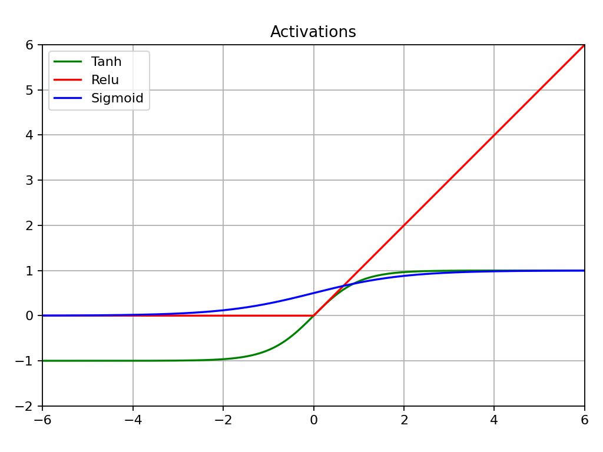

# Activation——激活函数

## Basic 基础知识

神经网络中的激活函数是一类在人工神经元（节点）中使用的函数，它们的主要作用是为神经网络引入非线性因素（关系）。

如果没有激活函数，无论神经网络有多少层，最终都只能表示线性关系，这将大大限制网络的表达能力和复杂度。

常见的几种激活函数有：Sigmoid、Tanh、Relu、Softmax等，几种函数图像如下：

## ReLU

ReLU函数，又称为线性整流函数，当前最流行的激活函数之一，其公式为：
$$
ReLU(x) = max(0, x)=
\begin{cases}
x, \quad x>0 \\
0, \quad x\leq 0
\end{cases}
$$
该公式也是ReLU函数的前向传播公式，而对于反向传播公式，也就是求导结果为：
$$
\frac{\partial ReLU(x)}{\partial x} =
\begin{cases}
1, \quad x>0 \\
0, \quad x\leq 0
\end{cases}
$$
也就是说，只有输入大于0的部分才有梯度。

## Sigmoid

Sigmoid，又称为S型函数，经典的激活函数之一，其公式为：
$$
Sigmoid(x) = \frac{1}{1+e^{-x}}=
\begin{cases}
\frac{1}{1+e^{-x}}, \quad x\geq0 \\
\frac{e^{x}}{1+e^{x}}, \quad x< 0
\end{cases}
$$
后续分成大于0和小于0两部分求结果的原因是为防止求指数时发生数值溢出现象。

该公式也是Sigmoid函数的前向传播公式，而对于反向传播公式，对Sigmoid函数求导有：
