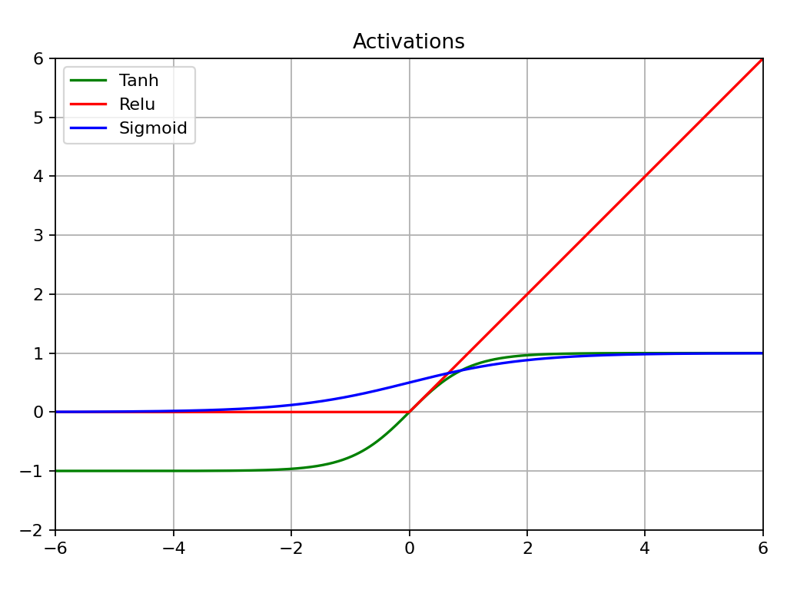

# Activation——激活函数

## Basic-基础知识

神经网络中的激活函数是一类在人工神经元（节点）中使用的函数，它们的主要作用是为神经网络引入非线性因素（关系）。

如果没有激活函数，无论神经网络有多少层，最终都只能表示线性关系，这将大大限制网络的表达能力和复杂度。

常见的几种激活函数有：Sigmoid、Tanh、Relu、Softmax 等，几种函数图像如下：

## ReLU

ReLU（Rectified Linear Unit，线性整流函数）是当前最流行的激活函数之一，广泛应用于各种深度学习模型中。其数学表达式为：
$$
ReLU(x) = max(0, x)=
\begin{cases}
x, \quad x>0 \\
0, \quad x\leq 0
\end{cases}
$$
具体来说，ReLU 函数的输出取决于输入值 x 的正负：

这种分段定义使得 ReLU 函数在输入为正时保持线性，而在输入为负时输出为零。这种特性使得 ReLU 函数在计算上非常高效，同时也能够有效缓解梯度消失问题。

### 前向传播公式

上述公式即为 ReLU 函数的前向传播公式，它将输入 x 映射到非负区间，即当输入为正时直接输出输入值，当输入为负时输出为零。

### 反向传播公式

在反向传播过程中，我们需要计算 ReLU 函数的导数。其导数表达式为：
$$
\frac{\mathrm{d}}{\mathrm{d}x} ReLU(x) =
\begin{cases}
1, \quad x>0 \\
0, \quad x\leq 0
\end{cases}
$$
这意味着，当输入 x 大于零时，ReLU 函数的导数为 1，其余部分导数为 0。换句话说，ReLU 函数仅在输入为正时才具有梯度，这使得它在训练过程中能够有效地传递梯度，加速模型的收敛。然而，ReLU 函数也存在一些缺点。当输入为负时，ReLU 的导数为零，这可能导致部分神经元在训练过程中“死亡”，即这些神经元不再对梯度有任何贡献，从而可能影响模型的训练效果。为了解决这一问题，研究者们提出了多种改进版本，例如 Leaky ReLU 等。

## Sigmoid

Sigmoid，又称为 S 型函数，是一种经典的激活函数，广泛应用于神经网络中。其数学表达式为：
$$
Sigmoid(x) = \frac{1}{1+e^{-x}}
$$
为了防止在计算指数时出现数值溢出问题，Sigmoid 函数的实现通常会根据输入值 x 的正负进行分段处理：
$$
Sigmoid(x) =
\begin{cases}
\frac{1}{1+e^{-x}}, \quad x\geq0 \\
\frac{e^{x}}{1+e^{x}}, \quad x< 0
\end{cases}
$$

这种分段处理方式能够有效避免因指数计算导致的数值不稳定问题，确保函数在不同输入范围内的数值稳定性。

### 前向传播公式

上述公式即为 Sigmoid 函数的前向传播公式，它将输入 x 映射到 (0,1) 区间内，输出值可以被解释为某种概率。

### 反向传播公式

在反向传播过程中，我们需要计算 Sigmoid 函数的导数。其导数表达式为：
$$
\begin{align}
\frac{\mathrm{d}}{\mathrm{d}x} Sigmoid(x) &= 
\frac{e^{-x}}{(1+e^{-x})^2}\\
&=\frac{1}{1+e^{-x}}\frac{e^{-x}}{1+e^{-x}}\\
&=\frac{1}{1+e^{-x}}(1-\frac{1}{1+e^{-x}})\\
&=Sigmoid(x)(1-Sigmoid(x))
\end{align}
$$

这个导数公式表明，Sigmoid 函数的导数可以表示为其自身值与其补数的乘积。这种形式不仅简洁，而且在计算上非常高效，特别适合在神经网络的反向传播中使用。

## Tanh

Tanh（双曲正切函数）是一种经典的激活函数，尤其在循环神经网络（RNN）中被广泛应用。其数学表达式为：
$$
Tanh(x) = \frac{e^x-e^{-x}}{e^x+e^{-x}}
$$
为了防止在计算指数时出现数值溢出问题，Tanh 函数的实现通常会根据输入值 x 的正负进行分段处理：
$$
Tanh(x) = 
\begin{cases}
\frac{1-e^{-2x}}{1+e^{-2x}}, \quad x\geq0 \\
\frac{e^{2x}-1}{1+e^{2x}}, \quad x< 0
\end{cases}
$$
这种分段处理方式能够有效避免因指数计算导致的数值不稳定问题，确保函数在不同输入范围内的数值稳定性。

### 前向传播公式

上述公式即为 Tanh 函数的前向传播公式，它将输入 x 映射到 (−1,1) 区间内，由于输出值的范围在 -1 到 1 之间，这种对称性使得 Tanh 函数在某些场景下比 Sigmoid 函数更具优势。

### 反向传播公式

在反向传播过程中，我们需要计算 Tanh 函数的导数。其导数表达式为：
$$
\begin{align}
\frac{\mathrm{d}}{\mathrm{d}x} Tanh(x) &= 
\frac{(e^x+e^{-x})^2-(e^x-e^{-x})^2}{(e^x+e^{-x})^2}\\
&=1-(\frac{e^x-e^{-x}}{e^x+e^{-x}})^2\\
&=1-Tanh^2(x)\\
\end{align}
$$
这个导数公式表明，Tanh 函数的导数可以表示为 $1-Tanh^2(x)$。这种形式不仅简洁，而且在计算上非常高效，特别适合在神经网络的反向传播中使用。
