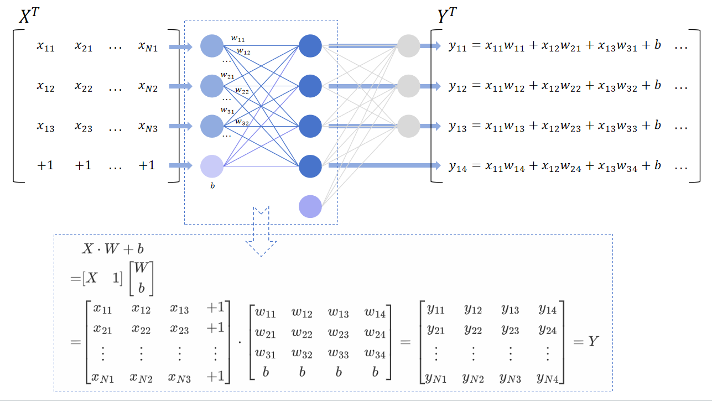

# Basic——基础知识

在学习神经网络的层级架构之前，必须先彻底了解梯度链式反向传播的原理，实际上梯度反向传播是基于复合函数求导这一数学原理的，也被称为链式法则，假设这里有$n$层复合函数，定义为：
$$
\begin{cases}
\begin{align}
x_2 &= f_1(x_1) \\
x_3 &= f_2(x_2) \\
\cdots \\
x_n &= f_{n-1}(x_{n-1})\\
y &= f_n(x_n)
\end{align}
\end{cases}
$$
在各个函数均连续可导的前提下，我们可以得到$y$对$x_1$的导数为：
$$
\frac{\mathrm{d} y}{\mathrm{d} x_1} = \frac{\mathrm{d} y}{\mathrm{d} x_n} \cdot \frac{\mathrm{d} x_n}{\mathrm{d} x_{n-1}} \cdot \cdots \frac{\mathrm{d} x_3}{\mathrm{d} x_2}\cdot \frac{\mathrm{d} x_2}{\mathrm{d} x_1}
$$
这里我们进一步假设这$n$层复合函数每个都是线性函数，定义为：
$$
\begin{cases}
x_2 = f_1(x_1) = x_1 \cdot w_1 + b_1\\
x_3 = f_2(x_2) = x_2 \cdot w_2 + b_2\\
\cdots \\
x_n = f_{n-1}(x_{n-1}) = x_{n-1} \cdot w_{n-1} + b_{n-1}\\
y = f_n(x_n) = x_n \cdot w_n + b_n
\end{cases}
$$
那么我们可以得到$y$对任意第$k$层的$x_k$、$w_k$和$b_k$的导数，表示为：
$$
\frac{\mathrm{d} y}{\mathrm{d} x_k} = \frac{\mathrm{d} y}{\mathrm{d} x_n} \cdot \frac{\mathrm{d} x_n}{\mathrm{d} x_{n-1}} \cdot \cdots \frac{\mathrm{d} x_{k+2}}{\mathrm{d} x_{k+1}} \cdot \frac{\mathrm{d} x_{k+1}}{\mathrm{d} x_k} = w_n \cdot w_{n-1} \cdot \cdots w_{k+1} \cdot w_k\\
\frac{\mathrm{d} y}{\mathrm{d} w_k} = \frac{\mathrm{d} y}{\mathrm{d} x_n} \cdot \frac{\mathrm{d} x_n}{\mathrm{d} x_{n-1}} \cdot \cdots \frac{\mathrm{d} x_{k+2}}{\mathrm{d} x_{k+1}} \cdot \frac{\mathrm{d} x_{k+1}}{\mathrm{d} w_k} = w_n \cdot w_{n-1} \cdot \cdots w_{k+1} \cdot x_k\\
\frac{\mathrm{d} y}{\mathrm{d} b_k} = \frac{\mathrm{d} y}{\mathrm{d} x_n} \cdot \frac{\mathrm{d} x_n}{\mathrm{d} x_{n-1}} \cdot \cdots \frac{\mathrm{d} x_{k+2}}{\mathrm{d} x_{k+1}} \cdot \frac{\mathrm{d} x_{k+1}}{\mathrm{d} b_k} = w_n \cdot w_{n-1} \cdot \cdots w_{k+1} \cdot 1
$$
其实这个形式已经与线性全连接层的梯度链式反向传播非常接近了，但这个形式是对于单个数值的求导，而神经网络的前向与反向传播均是矩阵的点乘等相关操作，所以需要对矩阵的反向传播过程进行推导，简单起见，这里先分析单层的神经网络的导数：

考虑一个单层的(不含隐层的)含有偏置的全连接层神经网络，其中输入为$X$，输出为$Y$，权重参数为$W$，偏置参数为$b$：
$$
Y = X \cdot W + b = \begin{bmatrix}X&1\end{bmatrix}\begin{bmatrix}W\\b\end{bmatrix} = X_1 \cdot W_b
$$
为方便表示，这里将偏置整合到权重参数中，然后在输入后面追加一个全1向量。可以根据下图的示意理解此公式：

接下来需要考虑损失值的计算，输出与真实值的差异被称为损失$Loss$，表示为:
$$
L = F_{criterion}(Y, \hat{Y})
$$
其中$\hat{Y}$是真实值，$F_{criterion}$为一种评价指标函数，用于评价输出与真实值的差异情况

这里首先假设输入$X$的形状为$(N,D)$，权重参数形状为$(D,C)$，输出的形状为$(N,C)$，那么根据前面的复合函数求导的链式法则，我们可以得到损失函数$L$关于权重参数矩阵$W$的导数为：
$$
\frac{\partial L}{\partial W} = \frac{\partial L}{\partial Y} \frac{\partial Y}{\partial W}
$$
根据链式法则，损失函数$L$关于权重矩阵$W$的单个元素$w_{ab}$的导数为：
$$
\frac{\partial L}{\partial w_{ab}} = \sum_{i=1}^N\sum_{j=1}^C\frac{\partial L}{\partial y_{ij}} \frac{\partial y_{ij}}{\partial w_{ab}}
$$
注意到由于$y_{ij} = \sum_{k=1}^D x_{ik}w_{kj}$，所以只有当$j=b$时，$y_{ij}$才与$w_{ab}$有关系，$\frac{\partial y_{ij}}{\partial w_{ab}}$才不为0，所以上式可以化简为：
$$
\frac{\partial L}{\partial w_{ab}} = \sum_{i=1}^N\frac{\partial L}{\partial y_{ib}} \frac{\partial y_{ib}}{\partial w_{ab}}
$$
而因为$y_{ib} = x_{ia}\cdot w_{ab}$，所以有$\frac{\partial y_{ib}}{\partial w_{ab}} = x_{ia}$，所以可将上式写为：
$$
\frac{\partial L}{\partial w_{ab}} = \sum_{i=1}^N\frac{\partial L}{\partial y_{ib}} x_{ia}
$$
而我们知道输入$X$的转置为：
$$
X^T = 
\begin{bmatrix}
x_{11} & x_{21} &\cdots &x_{N1}\\
x_{12} & x_{22} &\cdots &x_{N2}\\
\vdots & \vdots & \ddots & \vdots \\
x_{1D} & x_{2D} &\cdots &x_{ND}\\
\end{bmatrix}
$$
所以对于损失函数$L$关于权重矩阵$W$的导数矩阵为：
$$
\begin{align}
\frac{\partial L}{\partial W} & =
\begin{bmatrix}
\frac{\partial L}{\partial w_{11}} & \frac{\partial L}{\partial w_{12}} &\cdots &\frac{\partial L}{\partial w_{1C}}\\
\frac{\partial L}{\partial w_{21}} & \frac{\partial L}{\partial w_{22}} &\cdots &\frac{\partial L}{\partial w_{2C}}\\
\vdots & \vdots & \ddots & \vdots \\
\frac{\partial L}{\partial w_{D1}} & \frac{\partial L}{\partial w_{D2}} &\cdots &\frac{\partial L}{\partial w_{DC}}\\
\end{bmatrix} \\ & =
\begin{bmatrix}
\sum_{i=1}^N\frac{\partial L}{\partial y_{i1}} x_{i1} & \sum_{i=1}^N\frac{\partial L}{\partial y_{i2}} x_{i1} &\cdots & \sum_{i=1}^N\frac{\partial L}{\partial y_{iC}} x_{i1}\\
\sum_{i=1}^N\frac{\partial L}{\partial y_{i1}} x_{i2} & \sum_{i=1}^N\frac{\partial L}{\partial y_{i2}} x_{i2} &\cdots & \sum_{i=1}^N\frac{\partial L}{\partial y_{iC}} x_{i2}\\
\vdots & \vdots & \ddots & \vdots \\
\sum_{i=1}^N\frac{\partial L}{\partial y_{i1}} x_{iD} & \sum_{i=1}^N\frac{\partial L}{\partial y_{i2}} x_{iD} &\cdots & \sum_{i=1}^N\frac{\partial L}{\partial y_{iC}} x_{iD}\\
\end{bmatrix} \\ & =
\begin{bmatrix}
x_{11} & x_{21} &\cdots &x_{N1}\\
x_{12} & x_{22} &\cdots &x_{N2}\\
\vdots & \vdots & \ddots & \vdots \\
x_{1D} & x_{2D} &\cdots &x_{ND}\\
\end{bmatrix} \cdot 
\begin{bmatrix}
\frac{\partial L}{\partial y_{11}} & \frac{\partial L}{\partial y_{12}} &\cdots & \frac{\partial L}{\partial y_{1C}} \\
\frac{\partial L}{\partial y_{21}} & \frac{\partial L}{\partial y_{22}} &\cdots & \frac{\partial L}{\partial y_{2C}} \\
\vdots & \vdots & \ddots & \vdots \\
\frac{\partial L}{\partial y_{N1}} & \frac{\partial L}{\partial y_{N2}} &\cdots & \frac{\partial L}{\partial y_{NC}}
\end{bmatrix} \\ & =
X^T \frac{\partial L}{\partial Y}
\end{align}
$$
如果权重参数包含偏置参数，即$W_b = \begin{bmatrix}W\\b\end{bmatrix}$，那么对于损失函数$L$关于该权重矩阵$W_b$的导数矩阵为：
$$
\frac{\partial L}{\partial W_b} = X_1 ^T\frac{\partial L}{\partial Y} =  \begin{bmatrix}X&1\end{bmatrix}^T\frac{\partial L}{\partial Y}
$$
同样的，损失函数$L$关于输入矩阵$X$的导数为：
$$
\frac{\partial L}{\partial X} = \frac{\partial L}{\partial Y} \frac{\partial Y}{\partial X}
$$
而其中对于$\frac{\partial Y}{\partial X}$中的元素，有：
$$
\frac{\partial y_{ij}}{\partial x_{ab}} = \frac{\partial}{\partial x_{ab}} \sum_{k=1}^D x_{ik}w_{kj}
$$
我们可以观察到，只有当$i=a$时，$y_{ij}$才与$x_{ab}$有关系，求导才不为0，所以上式可以化简为：
$$
\frac{\partial y_{ij}}{\partial x_{ab}} = \frac{\partial}{\partial x_{ab}} \sum_{k=1}^D x_{ak}w_{kj}=w_{bj}
$$
所以损失函数$L$关于输入矩阵$X$的导数中的元素为：
$$
\frac{\partial L}{\partial x_{ab}} = \sum_{j=1}^C\frac{\partial L}{\partial y_{aj}} \frac{\partial y_{aj}}{\partial x_{ab}} = \sum_{j=1}^C\frac{\partial L}{\partial y_{aj}}w_{bj}
$$
而我们知道权重矩阵$W$的转置为：
$$
W^T = 
\begin{bmatrix}
w_{11} & w_{21} &\cdots &w_{D1}\\
w_{12} & w_{22} &\cdots &w_{D2}\\
\vdots & \vdots & \ddots & \vdots \\
w_{1C} & w_{2C} &\cdots &w_{DC}\\
\end{bmatrix}
$$
所以对于损失函数$L$关于输入矩阵$X$的导数矩阵为：
$$
\begin{align}
\frac{\partial L}{\partial X} & =
\begin{bmatrix}
\frac{\partial L}{\partial x_{11}} & \frac{\partial L}{\partial x_{12}} &\cdots &\frac{\partial L}{\partial x_{1D}}\\
\frac{\partial L}{\partial x_{21}} & \frac{\partial L}{\partial x_{22}} &\cdots &\frac{\partial L}{\partial x_{2D}}\\
\vdots & \vdots & \ddots & \vdots \\
\frac{\partial L}{\partial x_{N1}} & \frac{\partial L}{\partial x_{N2}} &\cdots &\frac{\partial L}{\partial x_{ND}}\\
\end{bmatrix} \\ & =
\begin{bmatrix}
\sum_{j=1}^C\frac{\partial L}{\partial y_{1j}}w_{1j} & \sum_{j=1}^C\frac{\partial L}{\partial y_{1j}}w_{2j} &\cdots & \sum_{j=1}^C\frac{\partial L}{\partial y_{1j}}w_{Dj}\\
\sum_{j=1}^C\frac{\partial L}{\partial y_{2j}}w_{1j} & \sum_{j=1}^C\frac{\partial L}{\partial y_{2j}}w_{2j} &\cdots & \sum_{j=1}^C\frac{\partial L}{\partial y_{2j}}w_{Dj}\\
\vdots & \vdots & \ddots & \vdots \\
\sum_{j=1}^C\frac{\partial L}{\partial y_{Nj}}w_{1j} & \sum_{j=1}^C\frac{\partial L}{\partial y_{Nj}}w_{2j} &\cdots & \sum_{j=1}^C\frac{\partial L}{\partial y_{Nj}}w_{Dj}\\
\end{bmatrix} \\ & =
\begin{bmatrix}
\frac{\partial L}{\partial y_{11}} & \frac{\partial L}{\partial y_{12}} &\cdots & \frac{\partial L}{\partial y_{1C}} \\
\frac{\partial L}{\partial y_{21}} & \frac{\partial L}{\partial y_{22}} &\cdots & \frac{\partial L}{\partial y_{2C}} \\
\vdots & \vdots & \ddots & \vdots \\
\frac{\partial L}{\partial y_{N1}} & \frac{\partial L}{\partial y_{N2}} &\cdots & \frac{\partial L}{\partial y_{NC}}
\end{bmatrix} 
\cdot
\begin{bmatrix}
w_{11} & w_{21} &\cdots &w_{D1}\\
w_{12} & w_{22} &\cdots &w_{D2}\\
\vdots & \vdots & \ddots & \vdots \\
w_{1C} & w_{2C} &\cdots &w_{DC}\\
\end{bmatrix} \\ & =
\frac{\partial L}{\partial Y} W^T
\end{align}\\
$$
所以综上，有：
$$
\frac{\partial L}{\partial W} = X^T \frac{\partial L}{\partial Y}\\
\frac{\partial L}{\partial X} = \frac{\partial L}{\partial Y} W^T\\
$$
且损失函数$L$关于包含偏置的权重矩阵$W_b$的导数矩阵为:
$$
\frac{\partial L}{\partial W_b} = X_1 ^T\frac{\partial L}{\partial Y} =  \begin{bmatrix}X&1\end{bmatrix}^T\frac{\partial L}{\partial Y}
$$
这里得到了反向传播过程中的单层神经网络的导数推导，接下来就可以得到多层神经网络的反向传播过程了，对于任意的n层线性全连接层神经网络，在先不考虑激活函数的前提下，有：
$$
\begin{cases}
X_2 = F_1(X_1) = X_1 \cdot W_1 + b_1\\
X_3 = F_2(X_2) = X_2 \cdot W_2 + b_2\\
\cdots \\
X_n = F_{n-1}(X_{n-1}) = X_{n-1} \cdot W_{n-1} + b_{n-1}\\
Y = F_n(X_n) = X_n \cdot W_n + b_n
\end{cases}
$$
假设该神经网络输入是$X_1$，输出是$Y$，而数据的真实值是$\hat{Y}$，那么输出与真实值的差异被称为损失$Loss$，表示为:
$$
L = F_{criterion}(Y, \hat{Y})
$$
若我们想将得到的这个损失传播给网络的第$k$层，则需要使用链式反向传播实现，即：
$$
\frac{\partial L}{\partial X_k} = \frac{\partial L}{\partial Y} \cdot \frac{\partial Y}{\partial X_n} \cdot \frac{\partial X_n}{\partial X_{n-1}} \cdot \cdots \frac{\partial X_{k+2}}{\partial X_{k+1}} \cdot \frac{\partial X_{k+1}}{\partial X_k} = \nabla L \cdot W_n^T \cdot W_{n-1}^T \cdot \cdots W_{k+1}^T \cdot W_k^T\\
\frac{\partial L}{\partial W_k} = \frac{\partial L}{\partial Y} \cdot \frac{\partial Y}{\partial X_n} \cdot \frac{\partial X_n}{\partial X_{n-1}} \cdot \cdots \frac{\partial X_{k+2}}{\partial X_{k+1}} \cdot \frac{\partial X_{k+1}}{\partial W_k} = X_k^T \cdot (\nabla L \cdot W_n^T \cdot W_{n-1}^T \cdot \cdots W_{k+1}^T)\\
$$
其中$\nabla L = \frac{\partial L}{\partial Y}$，也就是损失函数的梯度。这是暂时没有考虑每个隐藏层包含激活函数的前提下得到的，下面我们将激活函数加入，假设最后一层没有激活函数，那么对于任意的n层线性全连接层神经网络，有：
$$
\begin{cases}
X_2 = \sigma_1 (X_2') = \sigma_1 (F_1(X_1)) = \sigma_1 (X_1 \cdot W_1 + b_1)\\
X_3 = \sigma_2 (X_3') = \sigma_2 (F_2(X_2)) = \sigma_2 (X_2 \cdot W_2 + b_2)\\
\cdots \\
X_{n} = \sigma_{n-1} (X_n') = \sigma_{n-1} (F_{n-1}(X_{n-1})) = \sigma_{n-1} (X_{n-1} \cdot W_{n-1} + b_{n-1})\\
Y = X_n \cdot W_n + b_n
\end{cases}
$$
那么该神经网络的链式反向传播表示为：
$$
\frac{\partial L}{\partial X_k} = \frac{\partial L}{\partial Y} \cdot \frac{\partial Y}{\partial X_n} \odot \frac{\partial X_n}{\partial X_n'} \cdot \frac{\partial X_n'}{\partial X_{n-1}} \odot \frac{\partial X_{n-1}}{\partial X_{n-1}'} \cdot \cdots \frac{\partial X_{k+2}'}{\partial X_{k+1}} \odot \frac{\partial X_{k+1}}{\partial X_{k+1}'} \cdot \frac{\partial X_{k+1}'}{\partial X_k} \\
\frac{\partial L}{\partial W_k} = \frac{\partial L}{\partial Y} \cdot \frac{\partial Y}{\partial X_n} \odot \frac{\partial X_n}{\partial X_n'} \cdot \frac{\partial X_n'}{\partial X_{n-1}} \odot \frac{\partial X_{n-1}}{\partial X_{n-1}'} \cdot \cdots \frac{\partial X_{k+2}'}{\partial X_{k+1}} \odot \frac{\partial X_{k+1}}{\partial X_{k+1}'} \cdot \frac{\partial X_{k+1}}{\partial W_k}\\
$$
其中$\odot$代表哈达玛积，表示两个矩阵对应元素相乘。从上式可以观察到，实际在原有的基础上，每层再添加一个激活函数的导数求哈达玛积即可，这个导数是可以根据激活函数表达式求得，令这个导数为：
$$
\frac{\partial X_k}{\partial X_k'} = A_k
$$
那么有：
$$
\frac{\partial L}{\partial X_k} = \frac{\partial L}{\partial Y} \cdot \frac{\partial Y}{\partial X_n} \odot \frac{\partial X_n}{\partial X_n'} \cdot \frac{\partial X_n'}{\partial X_{n-1}} \odot \frac{\partial X_{n-1}}{\partial X_{n-1}'} \cdot \cdots \frac{\partial X_{k+2}'}{\partial X_{k+1}} \odot \frac{\partial X_{k+1}}{\partial X_{k+1}'} \cdot \frac{\partial X_{k+1}'}{\partial X_k} \\
= \nabla L \cdot W_n^T \odot A_n \cdot W_{n-1}^T \odot A_{n-1} \cdot \cdots W_{k+1}^T \odot A_{k+1} \cdot W_k^T
\\
\\
\frac{\partial L}{\partial W_k} = \frac{\partial L}{\partial Y} \cdot \frac{\partial Y}{\partial X_n} \odot \frac{\partial X_n}{\partial X_n'} \cdot \frac{\partial X_n'}{\partial X_{n-1}} \odot \frac{\partial X_{n-1}}{\partial X_{n-1}'} \cdot \cdots \frac{\partial X_{k+2}'}{\partial X_{k+1}} \odot \frac{\partial X_{k+1}}{\partial X_{k+1}'} \cdot \frac{\partial X_{k+1}}{\partial W_k}\\
=  X_k^T \cdot (\nabla L \cdot W_n^T \odot A_n \cdot W_{n-1}^T \odot A_{n-1} \cdot \cdots W_{k+1}^T \odot A_{k+1})
$$
然后令：
$$
\Delta_n = \nabla L \cdot W_n^T \\
\Delta_{n-1} = \nabla L \cdot W_n^T \odot A_n \cdot W_{n-1}^T\\
\Delta_k = \nabla L \cdot W_n^T \odot A_n \cdot W_{n-1}^T \odot A_{n-1} \cdot \cdots W_{k}^T
$$
那么有：
$$
\frac{\partial L}{\partial X_k} = \Delta_{k+1} \odot A_{k+1} \cdot W_k^T \\ 
\frac{\partial L}{\partial W_k} = X_k^T \cdot (\Delta_{k+1} \odot A_{k+1}) \\
\Delta_{k} = \Delta_{k+1} \odot A_{k+1} \cdot W_k^T
$$
所以第$k$层的梯度为：
$$
\nabla W_k = \frac{1}{N} \cdot \frac{\partial L}{\partial W_k} = \frac{1}{N}\cdot X_k^T \cdot (\Delta_{k+1} \odot A_{k+1})
$$
其中$N$为当前进行优化的数据集批次大小，也就是$X$的第一个维度大小。如此一来，就可以将“差异”，也就是“梯度”，反向传播到每层网络，然后就可以利用梯度下降算法对模型每层的权重参数进行更新了，具体公式为：
$$
W^{new}_k = W^{old}_k - \eta\nabla W_k = W^{old}_k - \eta\frac{1}{N}\frac{\partial L}{\partial W_k}
$$
其中$\eta$为学习率，具体关于梯度下降算法在<[Optimizer——优化器](Optimizer.md)>中有详细介绍。