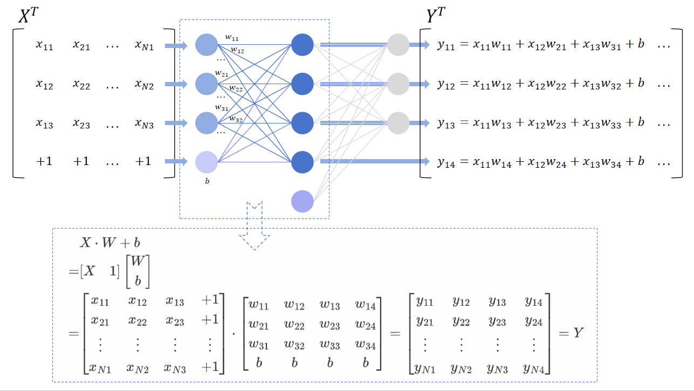
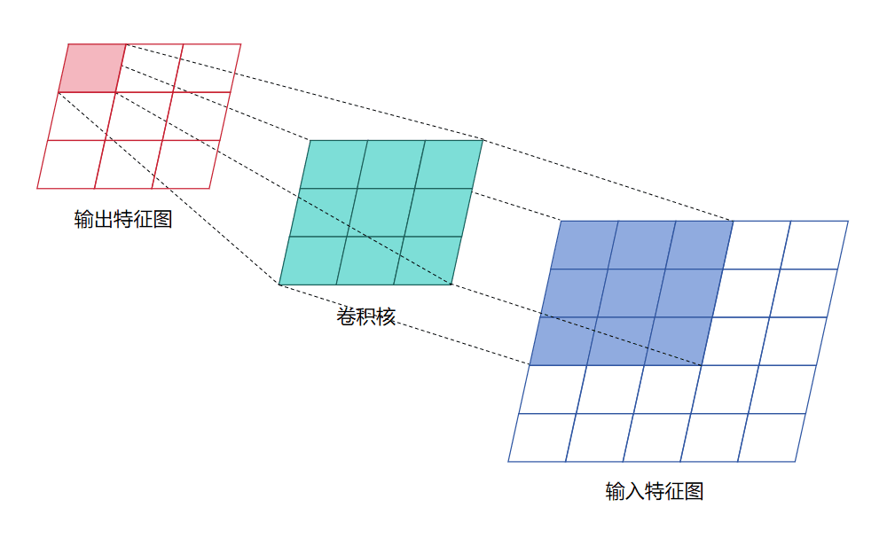
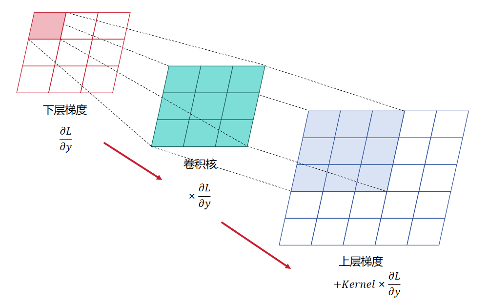

# Layer——层级架构

## Basic-基础知识

在学习神经网络的层级架构之前，必须先彻底了解梯度链式反向传播的原理，实际上梯度反向传播是基于复合函数求导这一数学原理的，也被称为链式法则，假设这里有$n$层复合函数，定义为：
$$
\begin{cases}
\begin{align}
x_2 &= f_1(x_1) \\
x_3 &= f_2(x_2) \\
\cdots \\
x_n &= f_{n-1}(x_{n-1})\\
y &= f_n(x_n)
\end{align}
\end{cases}
$$
在各个函数均连续可导的前提下，我们可以得到$y$对$x_1$的导数为：
$$
\frac{\mathrm{d} y}{\mathrm{d} x_1} = \frac{\mathrm{d} y}{\mathrm{d} x_n} \cdot \frac{\mathrm{d} x_n}{\mathrm{d} x_{n-1}} \cdot \cdots \frac{\mathrm{d} x_3}{\mathrm{d} x_2}\cdot \frac{\mathrm{d} x_2}{\mathrm{d} x_1}
$$
这里我们进一步假设这$n$层复合函数每个都是线性函数，定义为：
$$
\begin{cases}
x_2 = f_1(x_1) = x_1 \cdot w_1 + b_1\\
x_3 = f_2(x_2) = x_2 \cdot w_2 + b_2\\
\cdots \\
x_n = f_{n-1}(x_{n-1}) = x_{n-1} \cdot w_{n-1} + b_{n-1}\\
y = f_n(x_n) = x_n \cdot w_n + b_n
\end{cases}
$$
那么我们可以得到$y$对任意第$k$层的$x_k$、$w_k$和$b_k$的导数，表示为：
$$
\frac{\mathrm{d} y}{\mathrm{d} x_k} = \frac{\mathrm{d} y}{\mathrm{d} x_n} \cdot \frac{\mathrm{d} x_n}{\mathrm{d} x_{n-1}} \cdot \cdots \frac{\mathrm{d} x_{k+2}}{\mathrm{d} x_{k+1}} \cdot \frac{\mathrm{d} x_{k+1}}{\mathrm{d} x_k} = w_n \cdot w_{n-1} \cdot \cdots w_{k+1} \cdot w_k\\
\frac{\mathrm{d} y}{\mathrm{d} w_k} = \frac{\mathrm{d} y}{\mathrm{d} x_n} \cdot \frac{\mathrm{d} x_n}{\mathrm{d} x_{n-1}} \cdot \cdots \frac{\mathrm{d} x_{k+2}}{\mathrm{d} x_{k+1}} \cdot \frac{\mathrm{d} x_{k+1}}{\mathrm{d} w_k} = w_n \cdot w_{n-1} \cdot \cdots w_{k+1} \cdot x_k\\
\frac{\mathrm{d} y}{\mathrm{d} b_k} = \frac{\mathrm{d} y}{\mathrm{d} x_n} \cdot \frac{\mathrm{d} x_n}{\mathrm{d} x_{n-1}} \cdot \cdots \frac{\mathrm{d} x_{k+2}}{\mathrm{d} x_{k+1}} \cdot \frac{\mathrm{d} x_{k+1}}{\mathrm{d} b_k} = w_n \cdot w_{n-1} \cdot \cdots w_{k+1} \cdot 1
$$
其实这个形式已经与线性全连接层的梯度链式反向传播非常接近了，但这个形式是对于单个数值的求导，而神经网络的前向与反向传播均是矩阵的点乘等相关操作，所以需要对矩阵的反向传播过程进行推导，简单起见，这里先分析单层的神经网络的导数：

考虑一个单层的(不含隐层的)含有偏置的全连接层神经网络，其中输入为$X$，输出为$Y$，权重参数为$W$，偏置参数为$b$：
$$
Y = X \cdot W + b = \begin{bmatrix}X&1\end{bmatrix}\begin{bmatrix}W\\b\end{bmatrix} = X_1 \cdot W_b
$$
为方便表示，这里将偏置整合到权重参数中，然后在输入后面追加一个全1向量。可以根据下图的示意理解此公式：




接下来需要考虑损失值的计算，输出与真实值的差异被称为损失$Loss$，表示为:
$$
L = F_{criterion}(Y, \hat{Y})
$$
其中$\hat{Y}$是真实值，$F_{criterion}$为一种评价指标函数，用于评价输出与真实值的差异情况

这里首先假设输入$X$的形状为$(N,D)$，权重参数形状为$(D,C)$，输出的形状为$(N,C)$，那么根据前面的复合函数求导的链式法则，我们可以得到损失函数$L$关于权重参数矩阵$W$的导数为：
$$
\frac{\partial L}{\partial W} = \frac{\partial L}{\partial Y} \frac{\partial Y}{\partial W}
$$
根据链式法则，损失函数$L$关于权重矩阵$W$的单个元素$w_{ab}$的导数为：
$$
\frac{\partial L}{\partial w_{ab}} = \sum_{i=1}^N\sum_{j=1}^C\frac{\partial L}{\partial y_{ij}} \frac{\partial y_{ij}}{\partial w_{ab}}
$$
注意到由于$y_{ij} = \sum_{k=1}^D x_{ik}w_{kj}$，所以只有当$j=b$时，$y_{ij}$才与$w_{ab}$有关系，$\frac{\partial y_{ij}}{\partial w_{ab}}$才不为0，所以上式可以化简为：
$$
\frac{\partial L}{\partial w_{ab}} = \sum_{i=1}^N\frac{\partial L}{\partial y_{ib}} \frac{\partial y_{ib}}{\partial w_{ab}}
$$
而因为$y_{ib} = x_{ia}\cdot w_{ab}$，所以有$\frac{\partial y_{ib}}{\partial w_{ab}} = x_{ia}$，所以可将上式写为：
$$
\frac{\partial L}{\partial w_{ab}} = \sum_{i=1}^N\frac{\partial L}{\partial y_{ib}} x_{ia}
$$
而我们知道输入$X$的转置为：
$$
X^T = 
\begin{bmatrix}
x_{11} & x_{21} &\cdots &x_{N1}\\
x_{12} & x_{22} &\cdots &x_{N2}\\
\vdots & \vdots & \ddots & \vdots \\
x_{1D} & x_{2D} &\cdots &x_{ND}\\
\end{bmatrix}
$$
所以对于损失函数$L$关于权重矩阵$W$的导数矩阵为：
$$
\begin{align}
\frac{\partial L}{\partial W} & =
\begin{bmatrix}
\frac{\partial L}{\partial w_{11}} & \frac{\partial L}{\partial w_{12}} &\cdots &\frac{\partial L}{\partial w_{1C}}\\
\frac{\partial L}{\partial w_{21}} & \frac{\partial L}{\partial w_{22}} &\cdots &\frac{\partial L}{\partial w_{2C}}\\
\vdots & \vdots & \ddots & \vdots \\
\frac{\partial L}{\partial w_{D1}} & \frac{\partial L}{\partial w_{D2}} &\cdots &\frac{\partial L}{\partial w_{DC}}\\
\end{bmatrix} \\ & =
\begin{bmatrix}
\sum_{i=1}^N\frac{\partial L}{\partial y_{i1}} x_{i1} & \sum_{i=1}^N\frac{\partial L}{\partial y_{i2}} x_{i1} &\cdots & \sum_{i=1}^N\frac{\partial L}{\partial y_{iC}} x_{i1}\\
\sum_{i=1}^N\frac{\partial L}{\partial y_{i1}} x_{i2} & \sum_{i=1}^N\frac{\partial L}{\partial y_{i2}} x_{i2} &\cdots & \sum_{i=1}^N\frac{\partial L}{\partial y_{iC}} x_{i2}\\
\vdots & \vdots & \ddots & \vdots \\
\sum_{i=1}^N\frac{\partial L}{\partial y_{i1}} x_{iD} & \sum_{i=1}^N\frac{\partial L}{\partial y_{i2}} x_{iD} &\cdots & \sum_{i=1}^N\frac{\partial L}{\partial y_{iC}} x_{iD}\\
\end{bmatrix} \\ & =
\begin{bmatrix}
x_{11} & x_{21} &\cdots &x_{N1}\\
x_{12} & x_{22} &\cdots &x_{N2}\\
\vdots & \vdots & \ddots & \vdots \\
x_{1D} & x_{2D} &\cdots &x_{ND}\\
\end{bmatrix} \cdot 
\begin{bmatrix}
\frac{\partial L}{\partial y_{11}} & \frac{\partial L}{\partial y_{12}} &\cdots & \frac{\partial L}{\partial y_{1C}} \\
\frac{\partial L}{\partial y_{21}} & \frac{\partial L}{\partial y_{22}} &\cdots & \frac{\partial L}{\partial y_{2C}} \\
\vdots & \vdots & \ddots & \vdots \\
\frac{\partial L}{\partial y_{N1}} & \frac{\partial L}{\partial y_{N2}} &\cdots & \frac{\partial L}{\partial y_{NC}}
\end{bmatrix} \\ & =
X^T \frac{\partial L}{\partial Y}
\end{align}
$$
如果权重参数包含偏置参数，即$W_b = \begin{bmatrix}W\\b\end{bmatrix}$，那么对于损失函数$L$关于该权重矩阵$W_b$的导数矩阵为：
$$
\frac{\partial L}{\partial W_b} = X_1 ^T\frac{\partial L}{\partial Y} =  \begin{bmatrix}X&1\end{bmatrix}^T\frac{\partial L}{\partial Y}
$$
同样的，损失函数$L$关于输入矩阵$X$的导数为：
$$
\frac{\partial L}{\partial X} = \frac{\partial L}{\partial Y} \frac{\partial Y}{\partial X}
$$
而其中对于$\frac{\partial Y}{\partial X}$中的元素，有：
$$
\frac{\partial y_{ij}}{\partial x_{ab}} = \frac{\partial}{\partial x_{ab}} \sum_{k=1}^D x_{ik}w_{kj}
$$
我们可以观察到，只有当$i=a$时，$y_{ij}$才与$x_{ab}$有关系，求导才不为0，所以上式可以化简为：
$$
\frac{\partial y_{ij}}{\partial x_{ab}} = \frac{\partial}{\partial x_{ab}} \sum_{k=1}^D x_{ak}w_{kj}=w_{bj}
$$
所以损失函数$L$关于输入矩阵$X$的导数中的元素为：
$$
\frac{\partial L}{\partial x_{ab}} = \sum_{j=1}^C\frac{\partial L}{\partial y_{aj}} \frac{\partial y_{aj}}{\partial x_{ab}} = \sum_{j=1}^C\frac{\partial L}{\partial y_{aj}}w_{bj}
$$
而我们知道权重矩阵$W$的转置为：
$$
W^T = 
\begin{bmatrix}
w_{11} & w_{21} &\cdots &w_{D1}\\
w_{12} & w_{22} &\cdots &w_{D2}\\
\vdots & \vdots & \ddots & \vdots \\
w_{1C} & w_{2C} &\cdots &w_{DC}\\
\end{bmatrix}
$$
所以对于损失函数$L$关于输入矩阵$X$的导数矩阵为：
$$
\begin{align}
\frac{\partial L}{\partial X} & =
\begin{bmatrix}
\frac{\partial L}{\partial x_{11}} & \frac{\partial L}{\partial x_{12}} &\cdots &\frac{\partial L}{\partial x_{1D}}\\
\frac{\partial L}{\partial x_{21}} & \frac{\partial L}{\partial x_{22}} &\cdots &\frac{\partial L}{\partial x_{2D}}\\
\vdots & \vdots & \ddots & \vdots \\
\frac{\partial L}{\partial x_{N1}} & \frac{\partial L}{\partial x_{N2}} &\cdots &\frac{\partial L}{\partial x_{ND}}\\
\end{bmatrix} \\ & =
\begin{bmatrix}
\sum_{j=1}^C\frac{\partial L}{\partial y_{1j}}w_{1j} & \sum_{j=1}^C\frac{\partial L}{\partial y_{1j}}w_{2j} &\cdots & \sum_{j=1}^C\frac{\partial L}{\partial y_{1j}}w_{Dj}\\
\sum_{j=1}^C\frac{\partial L}{\partial y_{2j}}w_{1j} & \sum_{j=1}^C\frac{\partial L}{\partial y_{2j}}w_{2j} &\cdots & \sum_{j=1}^C\frac{\partial L}{\partial y_{2j}}w_{Dj}\\
\vdots & \vdots & \ddots & \vdots \\
\sum_{j=1}^C\frac{\partial L}{\partial y_{Nj}}w_{1j} & \sum_{j=1}^C\frac{\partial L}{\partial y_{Nj}}w_{2j} &\cdots & \sum_{j=1}^C\frac{\partial L}{\partial y_{Nj}}w_{Dj}\\
\end{bmatrix} \\ & =
\begin{bmatrix}
\frac{\partial L}{\partial y_{11}} & \frac{\partial L}{\partial y_{12}} &\cdots & \frac{\partial L}{\partial y_{1C}} \\
\frac{\partial L}{\partial y_{21}} & \frac{\partial L}{\partial y_{22}} &\cdots & \frac{\partial L}{\partial y_{2C}} \\
\vdots & \vdots & \ddots & \vdots \\
\frac{\partial L}{\partial y_{N1}} & \frac{\partial L}{\partial y_{N2}} &\cdots & \frac{\partial L}{\partial y_{NC}}
\end{bmatrix} 
\cdot
\begin{bmatrix}
w_{11} & w_{21} &\cdots &w_{D1}\\
w_{12} & w_{22} &\cdots &w_{D2}\\
\vdots & \vdots & \ddots & \vdots \\
w_{1C} & w_{2C} &\cdots &w_{DC}\\
\end{bmatrix} \\ & =
\frac{\partial L}{\partial Y} W^T
\end{align}\\
$$
所以综上，有：
$$
\frac{\partial L}{\partial W} = X^T \frac{\partial L}{\partial Y}\\
\frac{\partial L}{\partial X} = \frac{\partial L}{\partial Y} W^T\\
$$
且损失函数$L$关于包含偏置的权重矩阵$W_b$的导数矩阵为:
$$
\frac{\partial L}{\partial W_b} = X_1 ^T\frac{\partial L}{\partial Y} =  \begin{bmatrix}X&1\end{bmatrix}^T\frac{\partial L}{\partial Y}
$$
这里得到了反向传播过程中的单层神经网络的导数推导，接下来就可以得到多层神经网络的反向传播过程了，对于任意的n层线性全连接层神经网络，在先不考虑激活函数的前提下，有：
$$
\begin{cases}
X_2 = F_1(X_1) = X_1 \cdot W_1 + b_1\\
X_3 = F_2(X_2) = X_2 \cdot W_2 + b_2\\
\cdots \\
X_n = F_{n-1}(X_{n-1}) = X_{n-1} \cdot W_{n-1} + b_{n-1}\\
Y = F_n(X_n) = X_n \cdot W_n + b_n
\end{cases}
$$
假设该神经网络输入是$X_1$，输出是$Y$，而数据的真实值是$\hat{Y}$，那么输出与真实值的差异被称为损失$Loss$，表示为:
$$
L = F_{criterion}(Y, \hat{Y})
$$
若我们想将得到的这个损失传播给网络的第$k$层，则需要使用链式反向传播实现，即：
$$
\frac{\partial L}{\partial X_k} = \frac{\partial L}{\partial Y} \cdot \frac{\partial Y}{\partial X_n} \cdot \frac{\partial X_n}{\partial X_{n-1}} \cdot \cdots \frac{\partial X_{k+2}}{\partial X_{k+1}} \cdot \frac{\partial X_{k+1}}{\partial X_k} = \nabla L \cdot W_n^T \cdot W_{n-1}^T \cdot \cdots W_{k+1}^T \cdot W_k^T\\
\frac{\partial L}{\partial W_k} = \frac{\partial L}{\partial Y} \cdot \frac{\partial Y}{\partial X_n} \cdot \frac{\partial X_n}{\partial X_{n-1}} \cdot \cdots \frac{\partial X_{k+2}}{\partial X_{k+1}} \cdot \frac{\partial X_{k+1}}{\partial W_k} = X_k^T \cdot (\nabla L \cdot W_n^T \cdot W_{n-1}^T \cdot \cdots W_{k+1}^T)\\
$$
其中$\nabla L = \frac{\partial L}{\partial Y}$，也就是损失函数的梯度。这是暂时没有考虑每个隐藏层包含激活函数的前提下得到的，下面我们将激活函数加入，假设最后一层没有激活函数，那么对于任意的n层线性全连接层神经网络，有：
$$
\begin{cases}
X_2 = \sigma_1 (X_2') = \sigma_1 (F_1(X_1)) = \sigma_1 (X_1 \cdot W_1 + b_1)\\
X_3 = \sigma_2 (X_3') = \sigma_2 (F_2(X_2)) = \sigma_2 (X_2 \cdot W_2 + b_2)\\
\cdots \\
X_{n} = \sigma_{n-1} (X_n') = \sigma_{n-1} (F_{n-1}(X_{n-1})) = \sigma_{n-1} (X_{n-1} \cdot W_{n-1} + b_{n-1})\\
Y = X_n \cdot W_n + b_n
\end{cases}
$$
那么该神经网络的链式反向传播表示为：
$$
\frac{\partial L}{\partial X_k} = \frac{\partial L}{\partial Y} \cdot \frac{\partial Y}{\partial X_n} \odot \frac{\partial X_n}{\partial X_n'} \cdot \frac{\partial X_n'}{\partial X_{n-1}} \odot \frac{\partial X_{n-1}}{\partial X_{n-1}'} \cdot \cdots \frac{\partial X_{k+2}'}{\partial X_{k+1}} \odot \frac{\partial X_{k+1}}{\partial X_{k+1}'} \cdot \frac{\partial X_{k+1}'}{\partial X_k} \\
\frac{\partial L}{\partial W_k} = \frac{\partial L}{\partial Y} \cdot \frac{\partial Y}{\partial X_n} \odot \frac{\partial X_n}{\partial X_n'} \cdot \frac{\partial X_n'}{\partial X_{n-1}} \odot \frac{\partial X_{n-1}}{\partial X_{n-1}'} \cdot \cdots \frac{\partial X_{k+2}'}{\partial X_{k+1}} \odot \frac{\partial X_{k+1}}{\partial X_{k+1}'} \cdot \frac{\partial X_{k+1}}{\partial W_k}\\
$$
其中$\odot$代表哈达玛积，表示两个矩阵对应元素相乘。从上式可以观察到，实际在原有的基础上，每层再添加一个激活函数的导数求哈达玛积即可，这个导数是可以根据激活函数表达式求得，令这个导数为：
$$
\frac{\partial X_k}{\partial X_k'} = A_k
$$
那么有：
$$
\frac{\partial L}{\partial X_k} = \frac{\partial L}{\partial Y} \cdot \frac{\partial Y}{\partial X_n} \odot \frac{\partial X_n}{\partial X_n'} \cdot \frac{\partial X_n'}{\partial X_{n-1}} \odot \frac{\partial X_{n-1}}{\partial X_{n-1}'} \cdot \cdots \frac{\partial X_{k+2}'}{\partial X_{k+1}} \odot \frac{\partial X_{k+1}}{\partial X_{k+1}'} \cdot \frac{\partial X_{k+1}'}{\partial X_k} \\
= \nabla L \cdot W_n^T \odot A_n \cdot W_{n-1}^T \odot A_{n-1} \cdot \cdots W_{k+1}^T \odot A_{k+1} \cdot W_k^T
\\
\\
\frac{\partial L}{\partial W_k} = \frac{\partial L}{\partial Y} \cdot \frac{\partial Y}{\partial X_n} \odot \frac{\partial X_n}{\partial X_n'} \cdot \frac{\partial X_n'}{\partial X_{n-1}} \odot \frac{\partial X_{n-1}}{\partial X_{n-1}'} \cdot \cdots \frac{\partial X_{k+2}'}{\partial X_{k+1}} \odot \frac{\partial X_{k+1}}{\partial X_{k+1}'} \cdot \frac{\partial X_{k+1}}{\partial W_k}\\
=  X_k^T \cdot (\nabla L \cdot W_n^T \odot A_n \cdot W_{n-1}^T \odot A_{n-1} \cdot \cdots W_{k+1}^T \odot A_{k+1})
$$
然后令：
$$
\Delta_n = \nabla L \cdot W_n^T \\
\Delta_{n-1} = \nabla L \cdot W_n^T \odot A_n \cdot W_{n-1}^T\\
\Delta_k = \nabla L \cdot W_n^T \odot A_n \cdot W_{n-1}^T \odot A_{n-1} \cdot \cdots W_{k}^T
$$
那么有：
$$
\frac{\partial L}{\partial X_k} = \Delta_{k+1} \odot A_{k+1} \cdot W_k^T \\ 
\frac{\partial L}{\partial W_k} = X_k^T \cdot (\Delta_{k+1} \odot A_{k+1}) \\
\Delta_{k} = \Delta_{k+1} \odot A_{k+1} \cdot W_k^T
$$
所以第$k$层的梯度为：
$$
\nabla W_k = \frac{1}{N} \cdot \frac{\partial L}{\partial W_k} = \frac{1}{N}\cdot X_k^T \cdot (\Delta_{k+1} \odot A_{k+1})
$$
其中$N$为当前进行优化的数据集批次大小，也就是$X$的第一个维度大小。如此一来，就可以将“差异”，也就是“梯度”，反向传播到每层网络，然后就可以利用梯度下降算法对模型每层的权重参数进行更新了，具体公式为：
$$
W^{new}_k = W^{old}_k - \eta\nabla W_k = W^{old}_k - \eta\frac{1}{N}\frac{\partial L}{\partial W_k}
$$
其中$\eta$为学习率，具体关于梯度下降算法在《Optimizer——优化器》中有详细介绍。

## Linear-线性层

线性层(Linear)，也称为全连接层，多层线性层的堆叠也被称为多层感知机(MLP)，下面将使用代码实现该层，首先是初始化阶段：

```python
    def __init__(self, input_size, output_size, activation=None, bias=True):
        super(Linear, self).__init__(input_size, output_size, activation, bias)
        # 保存输入与输出以及batch大小
        self.input_1, self.output, self.batch_size = None, None, 1
        # 初始化权重
        self.weight = np.zeros((self.output_size, self.input_size + self.bias))
        # 何凯明的方法初始化权重
        self.weight = self.kaiming_uniform_(self.weight, gain=self.get_gain(), bias=self.bias)
        # 实例化激活函数
        if self.activation is not None:
            self.activation = self.activation()
        # 初始化梯度
        self.grad = np.zeros_like(self.weight)
        # 计算参数量
        self.num_params = self.weight.size
```

下面是详细解释：

初始化输入、输出、批大小，这三个变量后面是会用到的：

```python
# 保存输入与输出以及batch大小
self.input_1, self.output, self.batch_size = None, None, 1
```

初始化权重参数为全0矩阵：

```python
# 初始化权重
self.weight = np.zeros((self.output_size, self.input_size + self.bias))
```

为了方便表示，这里将权重参数的形状初始化为$(C, D)$，其中$D$为输入维度大小，$C$为输出维度大小。我们将该权重定义为$\hat{W}$，这里使用的是前面介绍的权重的转置，也就是$\hat{W} = W^T$，另外如果要求有偏置则权重参数的形状为$(C, D+1)$，这样得到的权重应该定义为$\hat{W}=\begin{bmatrix}W&b\end{bmatrix}^T$，之后将权重初始化：

```python
# 何凯明的方法初始化权重
self.weight = self.kaiming_uniform_(self.weight, gain=self.get_gain(), bias=self.bias)
```

这里默认使用何凯明大佬的方法对权重进行初始化，具体的初始化函数将在“Layer父类”这一节中说明，然后初始化梯度为全0矩阵，且与权重大小相同：

```python
# 初始化梯度
self.grad = np.zeros_like(self.weight)
```

若指定了激活函数类型，则对激活函数进行实例化，具体激活函数在《Activation——激活函数》中有详细介绍

```python
# 实例化激活函数
if self.activation is not None:
	self.activation = self.activation()
```

最后计算该层的参数量，其实就是整个权重矩阵的元素个数：

```python
# 计算参数量
self.num_params = self.weight.size
```

在初始化后需要提供一些必要的函数和接口：

由于每次反向传播更新权重参数后，之前的梯度仍然存在，所以需要提供梯度置0的接口函数：

```python
    def zero_grad(self):
        """梯度置0"""
        self.grad = np.zeros_like(self.weight)
```

为了方便获取模型中该层的权重参数和设置该层的权重参数，提供了获取与修改参数的函数：

```python
    def get_parameters(self):
        """获取该层权重参数"""
        return self.weight.tolist()

    def set_parameters(self, weight_):
        """设置该层权重参数"""
        # 将权重变为array类型
        weight = weight_ if isinstance(weight_, np.ndarray) else np.array(weight_)
        assert self.weight.shape == weight.shape
        self.weight = weight
```

接下来就是核心部分，前向传播与反向传播了，首先对于前向传播，得到输出数据后，先保存这批数据的批大小，以便反向传播时使用：

```python
# 记录batch大小
self.batch_size = input_.shape[0]
```

然后得到输入的转置，即$\hat{X} = X^T$，这样操作是为了使用梯度反向传播时方便使用，并且如果考虑偏置值的话需要额外为输入的末尾追加一个全1的向量，即$\hat{X}=\begin{bmatrix}X\\1\end{bmatrix}^T$，这样操作是为了方便加入偏置参数，可以使用梯度下降对权重和偏置参数一起进行优化。

```python
# 形状转置 (n,m) => (m,n)
self.input_1 = input_.T.copy()
if self.bias:
    self.input_1 = np.vstack((self.input_1, np.ones(shape=(1, self.input_1.shape[1]))))
# Y = [X 1] @ [W b]^T = X @ W + b
# 形状: (n,k) = ((k,m) @ (m,n)).T
self.output = (self.weight @ self.input_1).T
```

在输入末尾追加全1向量可以将偏置直接整合到权重参数上，方便使用梯度下降一起进行优化，带偏置得到输出矩阵的具体公式为：
$$
Y = (\hat{W} \cdot \hat{X})^T = \hat{X}^T \cdot \hat{W}^T = \begin{bmatrix}X\\1\end{bmatrix}^T\begin{bmatrix}W&b\end{bmatrix}^T=
\begin{bmatrix}X&1\end{bmatrix}\begin{bmatrix}W\\b\end{bmatrix}= X \cdot W + b
$$
然后如果设置了激活函数则需要使用激活函数对输出进行激活并返回输出值：

```python
# 激活函数激活
output_ = self.output.copy()
if self.activation is not None:
    output_ = self.activation.forward(output_)
return output_
```

接下来是反向传播过程，若该层使用了激活函数，则需要先将上层传播过来的梯度与激活函数的梯度相乘：

```python
if self.activation is not None:
    delta = delta * self.activation.backward(self.output)
```

然后再根据公式得到该层的梯度，根据前面的推导，该层梯度的公式为：
$$
\frac{\partial L}{\partial W_k} = X_k^T \cdot (\Delta_{k+1} \odot A_{k+1}) = \hat{X_k} \cdot \hat{\Delta_{k+1}}
$$
注意这里的$\hat{\Delta_{k+1}}$为$\Delta_{k+1} \odot A_{k+1}$，因为前面已经更新；而这里使用的权重矩阵实际是权重矩阵的转置，所以有：
$$
\frac{\partial L}{\partial \hat{W_k}} = \frac{\partial L}{\partial W_k^T} = (\hat{X_k} \cdot \hat{\Delta_{k+1}})^T
$$
之后就可以实现对梯度的累积，要注意若输入是有多个数据组成的一个批次，则需取整个批次的平均梯度：
$$
\nabla \hat{W_k} = \frac{1}{N} \cdot \frac{\partial L}{\partial \hat{W_k}} = \frac{1}{N} \cdot \frac{\partial L}{\partial W_k^T} = \frac{1}{N} \cdot (\hat{X_k} \cdot \hat{\Delta_{k+1}})^T
$$

```python
# 计算梯度(累积梯度) 取平均
# 形状: (c,d) = ((d,n) @ (n,c)).T
self.grad += (self.input_1 @ delta).T / self.batch_size
```

之后需要将梯度传递到上一层网络，根据前面的推导得到的公式为：
$$
\Delta_{k} = \Delta_{k+1} \odot A_{k+1} \cdot W_k^T
$$
而$\hat{\Delta_{k+1}} = \Delta_{k+1} \odot A_{k+1}$，所以有：
$$
\Delta_{k} = 
\begin{cases}
\hat{\Delta_{k+1}} \cdot \hat{W_k}[:, 1:n-1], \quad \text{if have bias}\\
\hat{\Delta_{k+1}} \cdot \hat{W_k}, \quad \text{if not have bias}\\
\end{cases}
$$
这里要注意，偏置参数得到的梯度是无需参与反向传播的，因为本层偏置与上层参数无关，所以传播梯度时要去掉该参数：

```python
if self.bias:
    # 偏置与上一层无关，无需参与反向传播
    delta_next = delta @ self.weight[:, :-1]
else:
    delta_next = delta @ self.weight
```

如此一来，只要保存一个$\Delta$值，然后连续调用每层的反向传播函数，并不断更新这个$\Delta$值，就可以使梯度在神经网络中实现反向传播了。

## Layer-层级父类

前面详细介绍了Linear线性层的实现，为规范之后所有实现的层级结构，并且方便各个层级调用通用的函数，所以先实现了Layer层级父类，首先是对父类进行初始化：

```python
    def __init__(self, input_size=None, output_size=None, activation=None, bias=False):
        self.input_size = input_size
        self.output_size = output_size
        self.activation = activation
        self.bias = bias
        # 当前是否是训练模式
        self.training = True
        self.num_params = 0
```

在初始化时，默认初始化输入输出大小，激活函数类型以及是否使用偏置等参数，考虑到有些层可能并不需要这些参数，所以默认设置为空。而“当前是否是训练模式”的设置，主要用于Dropout层和Batch Norm层，因为这两个层在训练模式和评估模式下表现不同。最后初始化该层的参数量，方便计算构建得到的模型参数量。

之后，为了模型调用方便，定义了层的调用函数，与PyTorch类似，可以直接使用对象名调用forward(前向传播)函数：

```python
    def __call__(self, *args, **kwargs):
        """方便直接使用对象名调用forward函数"""
        return self.forward(*args, **kwargs)
```

然后定义了子类可以重写的函数，包括梯度置0、获取权重参数、设置权重参数和获取权重参数数量。还定义了子类必须重新的函数，即前向传播与反向传播函数：

```python
    def zero_grad(self):
        """梯度置为0矩阵"""
        pass

    def get_parameters(self):
        """获取该层的权重参数"""
        pass

    def set_parameters(self, *args, **kwargs):
        """设置该层的权重参数"""
        pass

    def get_num_params(self):
        """获取该层的参数数量"""
        pass

    def forward(self, *args, **kwargs):
        """该层前向传播"""
        raise NotImplementedError

    def backward(self, *args, **kwargs):
        """该层反向传播"""
        raise NotImplementedError
```

之后就是创建权重参数初始化的函数了，首先需要先计算"扇入"（fan_in）和"扇出"（fan_out）大小。在神经网络中，"扇入"（fan_in）和"扇出"（fan_out）是描述神经元连接数量的术语。这些术语来源于电路设计，其中"扇入"指的是一个门（或神经元）的输入数量，而"扇出"指的是一个门（或神经元）的输出数量。

在全连接网络中，扇入和扇出的大小就是权重参数的形状，但在卷积网络中，扇入和扇出的大小还需要在原形状的基础上再乘以感受野的大小。另外由于参数矩阵可能包含偏置，但输入大小是不包含偏置的，所以存在偏置时需要去掉偏置：

```python
    @staticmethod
    def cal_fan_in_and_fan_out(matrix: np.ndarray, bias=True):
        """计算扇入扇出值"""
        dimensions = matrix.ndim  # 矩阵维度
        if dimensions < 2:
            raise ValueError("Fan in and fan out can not be computed for matrix with fewer than 2 dimensions")
        input_size = matrix.shape[1] - bias  # 输入大小（或输入通道数）
        output_size = matrix.shape[0]  # 输出大小（或输出通道数）
        field_size = 1  # 感受野大小
        if dimensions > 2:
            field_size = np.size(matrix[0][0])
        # 计算扇入扇出值
        fan_in = input_size * field_size
        fan_out = output_size * field_size
        return fan_in, fan_out
```

下面介绍各个权重初始化的函数，首先是Xavier初始化，其有两种形式：均匀分布和正态分布

Xavier均匀分布初始化是从均匀分布$U(-x,x)$中抽取权重参数，其中$x=\sqrt{\frac{6}{n_{in}+n_{out}}}$

```python
    def xavier_uniform_(self, matrix: np.ndarray, gain=1.0, bias=True):
        """Xavier均匀分布随机初始化(适用于Sigmoid和Tanh函数)"""
        fan_in, fan_out = self.cal_fan_in_and_fan_out(matrix, bias)
        bound = gain * np.sqrt(6.0 / float(fan_in + fan_out))
        return np.random.uniform(-bound, bound, matrix.shape)
```

Xavier正态分布初始化是从正态分布$N(0,\sigma)$中抽取权重参数，其中$\sigma=\sqrt{\frac{2}{n_{in}+n_{out}}}$

```python
    def xavier_normal_(self, matrix: np.ndarray, gain=1.0, bias=True):
        """Xavier正态分布随机初始化(适用于Sigmoid和Tanh函数)"""
        fan_in, fan_out = self.cal_fan_in_and_fan_out(matrix, bias)
        std = gain * np.sqrt(2.0 / float(fan_in + fan_out))
        return np.random.normal(0., std, matrix.shape)
```

之后是何凯明大佬提出的Kaiming初始化，其也是有均匀分布和正态分布两种形式

Kaiming均匀分布初始化是从均匀分布$U(-x,x)$中抽取权重参数，其中$x=gain\times\sqrt{\frac{3}{(1+a)^2}\times n_{fan}}$

其中$a$是激活函数负半轴的斜率，对于ReLU激活函数，$a=0$，$n_{fan}$是根据条件来指定使用扇入还是扇出大小，$gain$是一种增益值，每种激活函数的$gain$值不一样，具体值为：
$$
gain =
\begin{cases}
\sqrt{2}, \quad ReLU\\
\frac{5}{3}, \quad Tanh\\
1, \quad Sigmoid,Convolution\\
\end{cases}
$$
Kaiming正态分布初始化是从正态分布$N(0,\sigma)$中抽取权重参数，其中$\sigma=gain\times\sqrt{\frac{1}{(1+a)^2}\times n_{fan}}$，下面是具体实现：

```python
    def get_gain(self):
        """获取gain值"""
        if self.activation is None:
            return 1.0
        elif self.activation.__name__ == 'ReLU':
            return np.sqrt(2)
        elif self.activation.__name__ == 'Tanh':
            return 5 / 3
        else:
            return 1.0

    def kaiming_uniform_(self, matrix: np.ndarray, a=0, mode='fan_in', gain=1.0, bias=True):
        """何凯明均匀分布随机初始化
        linear/sigmoid/conv/identity: gain = :math:`1`
        relu: gain = :math:`\\sqrt{2}`
        tanh: gain = :math:`\\frac{5}{3}`
        leaky_relu: gain = :math:`\\sqrt{\\frac{2}{1 + a^2}}`
        """
        fan_in, fan_out = self.cal_fan_in_and_fan_out(matrix, bias)
        fan = fan_in if mode == 'fan_in' else fan_out
        bound = gain * np.sqrt(3.0) / np.sqrt((1 + a * a) * fan)
        return np.random.uniform(-bound, bound, matrix.shape)

    def kaiming_normal_(self, matrix: np.ndarray, a=0, mode='fan_in', gain=1.0, bias=True):
        """何凯明正态分布随机初始化
        linear/sigmoid/conv/identity: gain = :math:`1`
        relu: gain = :math:`\\sqrt{2}`
        tanh: gain = :math:`\\frac{5}{3}`
        leaky_relu: gain = :math:`\\sqrt{\\frac{2}{1 + a^2}}`
        """
        fan_in, fan_out = self.cal_fan_in_and_fan_out(matrix, bias)
        fan = fan_in if mode == 'fan_in' else fan_out
        std = gain / np.sqrt((1 + a * a) * fan)
        return np.random.normal(0., std, matrix.shape)
```

之后的定义的一些函数是卷积池化等层所使用的通用静态函数，将在具体的层中详细说明。

## Identity-恒等映射层

恒等映射层是一种特殊的层，它的作用是将输入直接传递为输出，而不进行任何计算或变换。虽然它看起来像是一个“无操作”的层，但实际上在某些情况下非常有用，比如作为占位符预留位置、用于调试验证、或者在动态网络中根据条件启用/禁用层的作用。它还可以保持输入输出形状一致，方便网络设计和实现。

## Dropout-丢弃层

Dropout 的核心思想是在训练过程中随机地丢弃（即置为零）一部分神经元的输出，从而减少神经元之间的协同适应性，增强模型的泛化能力。其具体的实现过程可以分为两个部分：

一是训练阶段，在训练阶段每次前向传播时，Dropout 层会随机选择一部分神经元，并将它们的输出置为零。被丢弃的概率是一个超参数，通常用 $p$ 表示($0<p<1$)。而且被保留的神经元的输出会按比例放大$\frac{1}{1-p}$，以保持网络的输出期望值不变。在反向传播时，被丢弃的神经元不会参与梯度更新，而保留的神经元会正常更新，且梯度也会按比例放大$\frac{1}{1-p}$。

二是测试阶段，在测试阶段，Dropout 层会被关闭，所有神经元都会被保留，并且输出不会进行缩放。这是因为测试阶段需要使用完整的网络来做出预测。

作为一种常见的正则化技术，Dropout 层用于防止神经网络的过拟合，迫使网络学习到更加鲁棒的特征，减少对特定神经元的依赖。当然，该层也有一些缺陷，使用后会增加训练时间，且会影响模型的收敛速度，也可能在一定程度上削弱神经网络的表现，所以使用时需要根据具体任务和网络结构进行调整，以平衡其正则化效果和对训练效率的影响。

## GCNConv-图卷积层

待更新...

## RNNCell-循环神经网络模块层

待更新...

## RNN-循环神经网络层

待更新...

## Conv2d-二维卷积层

卷积，作为一种数学运算，最开始是在信号处理领域中提出的概念，卷积运算在信号处理中用于模拟线性时不变系统的输出，其中一个信号通过另一个信号（如滤波器）的影响。这个概念后来被引入到图像处理和深度学习中，诞生了卷积神经网络（Convolutional Neural Networks, CNNs）这一经典的神经网络，在卷积神经网络中，卷积被用来提取图像数据的局部特征，通过在输入图像上滑动卷积核（滤波器），并计算其与图像的局部区域的点积，生成特征图。这些特征图捕捉了图像的局部模式，如边缘、纹理等，并且由于权重共享和稀疏连接，使得网络能够高效地学习到具有平移不变性的特征。

二维卷积的过程可见下面的示例：



为简单起见，下面使用单通道矩阵、步长为1、填充为0的条件下对卷积及其梯度进行推导：

定义输入为$X$，卷积核为$V$，输出为$Y$，那么有：
$$
Y = V \circledast X \\
\begin{bmatrix}
y_{1,1} & y_{2,1} &\cdots &y_{ow,1}\\
y_{1,2} & y_{2,2} &\cdots &y_{ow,2}\\
\vdots & \vdots & \ddots & \vdots \\
y_{1,oh} & y_{2,oh} &\cdots &y_{ow,oh}\\
\end{bmatrix}=
\begin{bmatrix}
v_{1,1} & v_{2,1} &\cdots &v_{kw,1}\\
v_{1,2} & v_{2,2} &\cdots &v_{kw,2}\\
\vdots & \vdots & \ddots & \vdots \\
v_{1,kh} & v_{2,kh} &\cdots &v_{kw,kh}\\
\end{bmatrix}\circledast
\begin{bmatrix}
x_{1,1} & x_{2,1} &\cdots &x_{iw,1}\\
x_{1,2} & x_{2,2} &\cdots &x_{iw,2}\\
\vdots & \vdots & \ddots & \vdots \\
x_{1,ih} & x_{2,ih} &\cdots &x_{iw,ih}\\
\end{bmatrix}
$$
其中$\circledast$为卷积符号，代表卷积操作，$iw,ih,ow,oh$分别代表输入和输出特征图的宽度和高度，$kw,kh$分别是卷积核的宽与高，将公式具体展开得：
$$
\begin{align}
y_{i,j} &= \sum_{w=1}^{kw}\sum_{h=1}^{kh}v_{w,h}x_{i+w,j+h}\\
&= 
\begin{bmatrix}
v_{1,1} & v_{2,1} &\cdots &v_{kw,1}\\
v_{1,2} & v_{2,2} &\cdots &v_{kw,2}\\
\vdots & \vdots & \ddots & \vdots \\
v_{1,kh} & v_{2,kh} &\cdots &v_{kw,kh}\\
\end{bmatrix} \odot
\begin{bmatrix}
x_{i+1,j+1} & x_{i+2,j+1} &\cdots &x_{i+kw,j+1}\\
x_{i+1,j+2} & x_{i+2,j+2} &\cdots &x_{i+kw,j+2}\\
\vdots & \vdots & \ddots & \vdots \\
x_{i+1,j+kh} & x_{i+2,j+kh} &\cdots &x_{i+kw,j+kh}\\
\end{bmatrix}
\end{align}
$$
其中$\odot$表示哈马达积，即两个矩阵对应元素相乘后求和。所以说图像二维卷积的本质就是将给定的卷积核作为一个“窗口”，每次卷积都是窗口上的元素与输入对应元素相乘后求和，进行下次卷积时就是在原图像上进行“滑动”操作再卷积。而对于多通道输入矩阵，多个卷积核求卷积的情况，无非就是多个矩阵之间的操作了，而对于步长大于1的情况，其实就是求和时按照倍数步长求和，对于有填充的情况则是将输入进行一定调整即可。

接下来对卷积的梯度进行推导，假定从下一层反向传播到该层的梯度(损失)为：
$$
\frac{\partial L}{\partial Y}=
\begin{bmatrix}
\frac{\partial L}{\partial y_{1,1}} & \frac{\partial L}{\partial y_{2,1}} &\cdots & \frac{\partial L}{\partial y_{ow,1}}\\
\frac{\partial L}{\partial y_{1,2}} & \frac{\partial L}{\partial y_{2,2}} &\cdots & \frac{\partial L}{\partial y_{ow,2}}\\
\vdots & \vdots & \ddots & \vdots \\
\frac{\partial L}{\partial y_{1,oh}} & \frac{\partial L}{\partial y_{2,oh}} &\cdots &\frac{\partial L}{\partial y_{ow,oh}}\\
\end{bmatrix}
$$
根据之前推导的卷积公式，我们可以得到单个输出对任意一个参数$v_{w^*,h^*}$的偏导：
$$
\begin{align}
\frac{\partial y_{i,j}}{\partial v_{w^*,h^*}}&=
\frac{\partial}{\partial v_{w^*,h^*}}\sum_{w=1}^{kw}\sum_{h=1}^{kh}v_{w,h}x_{i+w,j+h}\\
&= \frac{\partial (v_{w^*,h^*}x_{i+w^*,j+h^*})}{v_{w^*,h^*}} \\
&= x_{i+w^*,j+h^*}
\end{align}
$$

那么将梯度(损失)传递到该参数上，得到该参数的损失为：
$$
\begin{align}
\frac{\partial L}{\partial v_{w^*,h^*}}&=
\sum_{i=1}^{iw}\sum_{j=1}^{ih}\frac{\partial L}{\partial y_{i,j}}\frac{\partial y_{i,j}}{\partial v_{w^*,h^*}}\\
&= \sum_{i=1}^{iw}\sum_{j=1}^{ih}\frac{\partial L}{\partial y_{i,j}} x_{i+w^*,j+h^*}\\
&= 
\begin{bmatrix}
\frac{\partial L}{\partial y_{1,1}} & \frac{\partial L}{\partial y_{2,1}} &\cdots & \frac{\partial L}{\partial y_{ow,1}}\\
\frac{\partial L}{\partial y_{1,2}} & \frac{\partial L}{\partial y_{2,2}} &\cdots & \frac{\partial L}{\partial y_{ow,2}}\\
\vdots & \vdots & \ddots & \vdots \\
\frac{\partial L}{\partial y_{1,oh}} & \frac{\partial L}{\partial y_{2,oh}} &\cdots &\frac{\partial L}{\partial y_{ow,oh}}\\
\end{bmatrix} \odot
\begin{bmatrix}
x_{1+w^*,1+h^*} & x_{2+w^*,1+h^*} &\cdots &x_{ow+w^*,1+h^*}\\
x_{1+w^*,2+h^*} & x_{2+w^*,2+h^*} &\cdots &x_{ow+w^*,2+h^*}\\
\vdots & \vdots & \ddots & \vdots \\
x_{1+w^*,oh+h^*} & x_{2+w^*,oh+h^*} &\cdots &x_{ow+w^*,oh+h^*}\\
\end{bmatrix}
\end{align}
$$

可以观察到，卷积核的损失可以通过下一层传递来的梯度(损失)与输入进行卷积得到，为了将梯度继续反向传播到上一层，还需要计算损失对输入的偏导，这部分比较复杂且不好理解，这里给出一个稍微简单的思路：我们知道对于任意两个元素的乘积，在对其中一个求偏导时的结果就是另一个元素，即假设有$y=v \cdot x$，那么应该有$\frac{\partial y}{\partial v}=x$；$\frac{\partial y}{\partial x}=v$，所以在计算损失对输入的偏导时，只要知道哪些元素与输入的元素相乘过即可，如何得到这些相乘过的元素呢？只需要再重新卷积一次就可以知道，我们可以将要传播到上一层的梯度初始化为一个全0的矩阵$\hat{X}$，那么它的一部分就是通过梯度的累加得到，具体表示为：
$$
\hat{X}[i:i+kw,j:j+kh] = \hat{X}[i:i+kw,j:j+kh] + \frac{\partial L}{\partial y_{i,j}}
\begin{bmatrix}
v_{1,1} & v_{2,1} &\cdots &v_{kw,1}\\
v_{1,2} & v_{2,2} &\cdots &v_{kw,2}\\
\vdots & \vdots & \ddots & \vdots \\
v_{1,kh} & v_{2,kh} &\cdots &v_{kw,kh}\\
\end{bmatrix}
$$
展开为矩阵为：
$$
\begin{bmatrix}
\hat{x}_{i+1,j+1} & \hat{x}_{i+2,j+1} &\cdots &\hat{x}_{i+kw,j+1}\\
\hat{x}_{i+1,j+2} & \hat{x}_{i+2,j+2} &\cdots &\hat{x}_{i+kw,j+2}\\
\vdots & \vdots & \ddots & \vdots \\
\hat{x}_{i+1,j+kh} & \hat{x}_{i+2,j+kh} &\cdots &\hat{x}_{i+kw,j+kh}\\
\end{bmatrix}
=
\begin{bmatrix}
\hat{x}_{i+1,j+1} & \hat{x}_{i+2,j+1} &\cdots &\hat{x}_{i+kw,j+1}\\
\hat{x}_{i+1,j+2} & \hat{x}_{i+2,j+2} &\cdots &\hat{x}_{i+kw,j+2}\\
\vdots & \vdots & \ddots & \vdots \\
\hat{x}_{i+1,j+kh} & \hat{x}_{i+2,j+kh} &\cdots &\hat{x}_{i+kw,j+kh}\\
\end{bmatrix}
+\frac{\partial L}{\partial y_{i,j}}
\begin{bmatrix}
v_{1,1} & v_{2,1} &\cdots &v_{kw,1}\\
v_{1,2} & v_{2,2} &\cdots &v_{kw,2}\\
\vdots & \vdots & \ddots & \vdots \\
v_{1,kh} & v_{2,kh} &\cdots &v_{kw,kh}\\
\end{bmatrix}
$$
实际上，该操作可以理解为一种“反向卷积”，具体的操作流程看下面的示意图就很清晰直观了：



## BatchNorm-批归一化层


