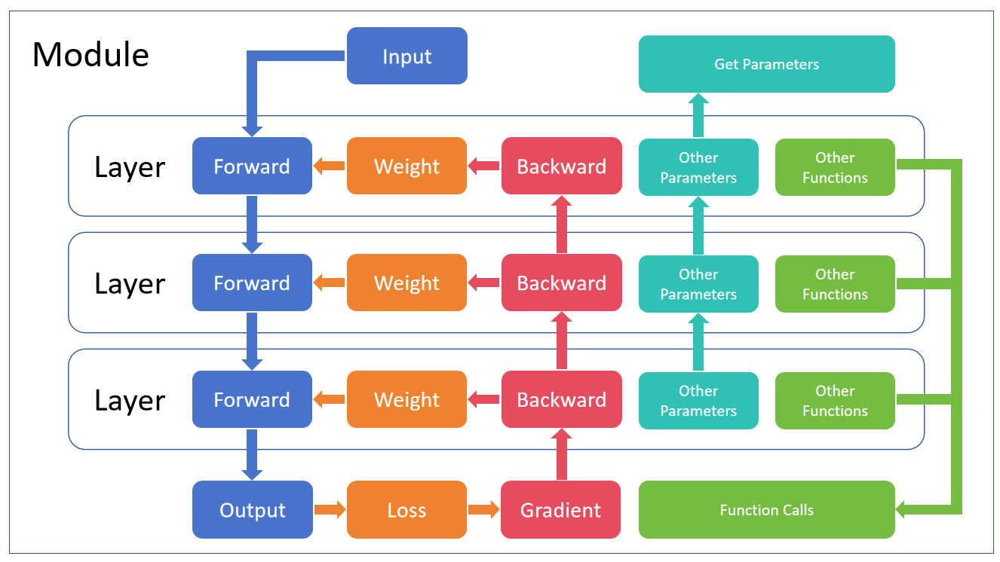
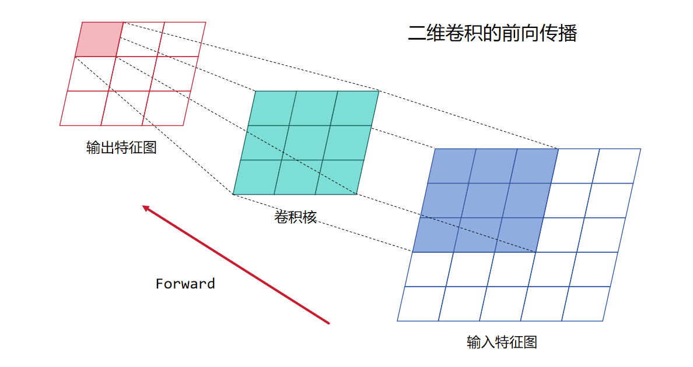
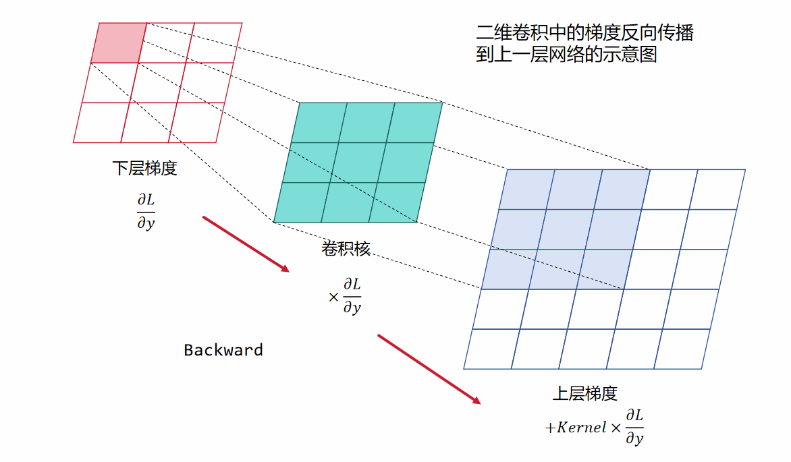

# Layer——神经网络层

## Basic-基础知识

在学习神经网络的层级架构之前，必须先彻底了解梯度链式反向传播的原理，具体内容参见<[Basic——基础知识](Basic.md)>

## Layer-层级父类

本项目采用层级架构来实现各个神经网络模块。相较于计算图的实现方式，虽然这种架构在灵活性方面稍显不足，但更能清晰展现梯度反向传播的细节，也更易于理解。以下是本项目架构的示意图：



从示意图中可以看出，任意类型的神经网络模块均由多个神经网络层堆叠而成。每种神经网络层可以是不同类型的层，但只有当输入与输出大小匹配时，才能实现堆叠。接下来，将详细阐述层级 Layer 父类的实现细节。

为规范之后所有实现的层级结构，并且方便各个层级调用通用的函数，所以实现了一个层级父类 Layer，首先是对父类进行初始化：

```python
class Layer:
    """层级父类"""

    def __init__(self, input_size=None, output_size=None, activation=None, bias=False):
        """
        层级父类
        :param input_size: 输入(维度)大小
        :param output_size: 输出(维度)大小
        :param activation: 激活函数类型
        :param bias: 是否使用偏置
        """
        self.input_size = input_size
        self.output_size = output_size
        self.activation = activation
        self.bias = bias
        # 当前是否是训练模式
        self.training = True
        self.num_params = 0
```

在初始化时，默认初始化输入输出大小，激活函数类型以及是否使用偏置等参数，考虑到有些层可能并不需要这些参数，所以默认设置为空。而“当前是否是训练模式”的设置，主要用于 Dropout 层和 Batch Norm 层，因为这两个层在训练模式和评估模式下表现不同。最后初始化该层的参数量，方便计算构建得到的模型参数量。

之后，为了模型调用方便，定义了层的调用函数，与 PyTorch 类似，可以直接使用对象名调用 forward(前向传播) 函数，也就是说调用 forward 函数时`model.forward(input_)`和`model(input_)`等价：

```python
    def __call__(self, *args, **kwargs):
        """方便直接使用对象名调用forward函数"""
        return self.forward(*args, **kwargs)
```

然后定义了子类可以重写的函数，包括梯度置0、获取权重参数、设置权重参数和获取权重参数数量。还定义了子类必须重新的函数，即前向传播与反向传播函数：

```python
    def zero_grad(self):
        """梯度置为0矩阵"""
        pass

    def get_parameters(self):
        """获取该层的权重参数"""
        pass

    def set_parameters(self, *args, **kwargs):
        """设置该层的权重参数"""
        pass

    def get_num_params(self):
        """获取该层的参数数量"""
        pass

    def forward(self, *args, **kwargs):
        """该层前向传播"""
        raise NotImplementedError

    def backward(self, *args, **kwargs):
        """该层反向传播"""
        raise NotImplementedError
```

之后就是创建权重参数初始化的函数，首先需要先计算"扇入"（fan_in）和"扇出"（fan_out）大小。在神经网络中，"扇入"（fan_in）和"扇出"（fan_out）是描述神经元连接数量的术语。这些术语来源于电路设计，其中"扇入"指的是一个门（或神经元）的输入数量，而"扇出"指的是一个门（或神经元）的输出数量，请注意这里的输入和输出数量指的是输入和输出的数据的维度大小。

在全连接网络中，扇入和扇出的大小就是权重参数的形状，但在卷积网络中，扇入和扇出的大小还需要在原形状的基础上再乘以感受野的大小。另外由于参数矩阵可能包含偏置，但输入大小是不包含偏置的，所以存在偏置时需要去掉偏置：

```python
    @staticmethod
    def cal_fan_in_and_fan_out(matrix: np.ndarray, bias=True):
        """计算扇入扇出值"""
        dimensions = matrix.ndim  # 矩阵维度
        if dimensions < 2:
            raise ValueError("Fan in and fan out can not be computed for matrix with fewer than 2 dimensions")
        input_size = matrix.shape[1] - bias  # 输入大小（或输入通道数）
        output_size = matrix.shape[0]  # 输出大小（或输出通道数）
        field_size = 1  # 感受野大小
        if dimensions > 2:
            field_size = np.size(matrix[0][0])
        # 计算扇入扇出值
        fan_in = input_size * field_size
        fan_out = output_size * field_size
        return fan_in, fan_out
```

下面介绍各个权重初始化的函数，首先是Xavier初始化，其有两种形式：均匀分布和正态分布

Xavier均匀分布初始化是从均匀分布$U(-x,x)$中抽取权重参数，其中$x=\sqrt{\frac{6}{n_{in}+n_{out}}}$

```python
    def xavier_uniform_(self, matrix: np.ndarray, gain=1.0, bias=True):
        """Xavier均匀分布随机初始化(适用于Sigmoid和Tanh函数)"""
        fan_in, fan_out = self.cal_fan_in_and_fan_out(matrix, bias)
        bound = gain * np.sqrt(6.0 / float(fan_in + fan_out))
        return np.random.uniform(-bound, bound, matrix.shape)
```

Xavier正态分布初始化是从正态分布$N(0,\sigma)$中抽取权重参数，其中$\sigma=\sqrt{\frac{2}{n_{in}+n_{out}}}$

```python
    def xavier_normal_(self, matrix: np.ndarray, gain=1.0, bias=True):
        """Xavier正态分布随机初始化(适用于Sigmoid和Tanh函数)"""
        fan_in, fan_out = self.cal_fan_in_and_fan_out(matrix, bias)
        std = gain * np.sqrt(2.0 / float(fan_in + fan_out))
        return np.random.normal(0., std, matrix.shape)
```

之后是何凯明大佬提出的Kaiming初始化，其也是有均匀分布和正态分布两种形式

Kaiming均匀分布初始化是从均匀分布$U(-x,x)$中抽取权重参数，其中$x=v_{gain}\times\sqrt{\frac{3}{(1+a)^2}\times n_{fan}}$

其中$a$是激活函数负半轴的斜率，对于ReLU激活函数，$a=0$，$n_{fan}$是根据条件来指定使用扇入还是扇出大小，$v_{gain}$是一种增益值，每种激活函数的值不一样，具体为：
$$
v_{gain} =
\begin{cases}
\sqrt{2}, \quad ReLU\\
\frac{5}{3}, \quad Tanh\\
1, \quad Sigmoid,Convolution\\
\end{cases}
$$
Kaiming正态分布初始化是从正态分布$N(0,\sigma)$中抽取权重参数，其中$\sigma=v_{gain}\times\sqrt{\frac{1}{(1+a)^2}\times n_{fan}}$，下面是具体实现：

```python
    def get_gain(self):
        """获取gain值"""
        if self.activation is None:
            return 1.0
        elif self.activation.__name__ == 'ReLU':
            return np.sqrt(2)
        elif self.activation.__name__ == 'Tanh':
            return 5 / 3
        else:
            return 1.0

    def kaiming_uniform_(self, matrix: np.ndarray, a=0, mode='fan_in', gain=1.0, bias=True):
        """何凯明均匀分布随机初始化
        linear/sigmoid/conv/identity: gain = :math:`1`
        relu: gain = :math:`\\sqrt{2}`
        tanh: gain = :math:`\\frac{5}{3}`
        leaky_relu: gain = :math:`\\sqrt{\\frac{2}{1 + a^2}}`
        """
        fan_in, fan_out = self.cal_fan_in_and_fan_out(matrix, bias)
        fan = fan_in if mode == 'fan_in' else fan_out
        bound = gain * np.sqrt(3.0) / np.sqrt((1 + a * a) * fan)
        return np.random.uniform(-bound, bound, matrix.shape)

    def kaiming_normal_(self, matrix: np.ndarray, a=0, mode='fan_in', gain=1.0, bias=True):
        """何凯明正态分布随机初始化
        linear/sigmoid/conv/identity: gain = :math:`1`
        relu: gain = :math:`\\sqrt{2}`
        tanh: gain = :math:`\\frac{5}{3}`
        leaky_relu: gain = :math:`\\sqrt{\\frac{2}{1 + a^2}}`
        """
        fan_in, fan_out = self.cal_fan_in_and_fan_out(matrix, bias)
        fan = fan_in if mode == 'fan_in' else fan_out
        std = gain / np.sqrt((1 + a * a) * fan)
        return np.random.normal(0., std, matrix.shape)
```

之后的定义的一些函数是卷积池化等层所使用的通用静态函数，将在具体的层中详细说明。

## Linear-线性层

线性层(Linear)，也称为全连接层，多层线性层的堆叠也被称为多层感知机(MLP)，下面将使用代码实现该层，首先是初始化阶段：

```python
class Linear(Layer):
    """线性层"""

    def __init__(self, input_size, output_size, activation=None, bias=True):
        """
        线性层
        :param input_size: 输入(维度)大小
        :param output_size: 输出(维度)大小
        :param activation: 激活函数类型
        :param bias: 是否使用偏置
        """
        super(Linear, self).__init__(input_size, output_size, activation, bias)
        # 保存输入与输出以及batch大小
        self.input_1, self.output, self.batch_size = None, None, 1
        # 初始化权重
        self.weight = np.zeros((self.output_size, self.input_size + self.bias))
        # 何凯明的方法初始化权重
        self.weight = self.kaiming_uniform_(self.weight, gain=self.get_gain(), bias=self.bias)
        # 实例化激活函数
        if self.activation is not None:
            self.activation = self.activation()
        # 初始化梯度
        self.grad = np.zeros_like(self.weight)
        # 计算参数量
        self.num_params = self.weight.size
```

下面是详细解释：

初始化输入、输出、批大小，这三个变量后面是会用到的：

```python
# 保存输入与输出以及batch大小
self.input_1, self.output, self.batch_size = None, None, 1
```

初始化权重参数为全0矩阵：

```python
# 初始化权重
self.weight = np.zeros((self.output_size, self.input_size + self.bias))
```

为了方便表示，这里将权重参数的形状初始化为$(C, D)$，其中$D$为输入维度大小，$C$为输出维度大小。我们将该权重定义为$\hat{W}$，这里使用的是前面介绍的权重的转置，也就是$\hat{W} = W^T$，另外如果要求有偏置则权重参数的形状为$(C, D+1)$，这样得到的权重应该定义为$\hat{W}=\begin{bmatrix}W&b\end{bmatrix}^T$，之后将权重初始化：

```python
# 何凯明的方法初始化权重
self.weight = self.kaiming_uniform_(self.weight, gain=self.get_gain(), bias=self.bias)
```

这里默认使用何凯明大佬的方法对权重进行初始化，具体的初始化函数将在“Layer父类”这一节中说明，然后初始化梯度为全0矩阵，且与权重大小相同：

```python
# 初始化梯度
self.grad = np.zeros_like(self.weight)
```

若指定了激活函数类型，则对激活函数进行实例化，具体激活函数在《Activation——激活函数》中有详细介绍

```python
# 实例化激活函数
if self.activation is not None:
	self.activation = self.activation()
```

最后计算该层的参数量，其实就是整个权重矩阵的元素个数：

```python
# 计算参数量
self.num_params = self.weight.size
```

在初始化后需要提供一些必要的函数和接口：

由于每次反向传播更新权重参数后，之前的梯度仍然存在，所以需要提供梯度置0的接口函数：

```python
    def zero_grad(self):
        """梯度置0"""
        self.grad = np.zeros_like(self.weight)
```

为了方便获取模型中该层的权重参数和设置该层的权重参数，提供了获取与修改参数的函数：

```python
    def get_parameters(self):
        """获取该层权重参数"""
        return self.weight.tolist()

    def set_parameters(self, weight_):
        """设置该层权重参数"""
        # 将权重变为array类型
        weight = weight_ if isinstance(weight_, np.ndarray) else np.array(weight_)
        assert self.weight.shape == weight.shape
        self.weight = weight
```

### 前向传播

接下来就是核心部分，前向传播与反向传播了，首先对于前向传播，得到输出数据后，先保存这批数据的批大小，以便反向传播时使用：

```python
# 记录batch大小
self.batch_size = input_.shape[0]
```

然后得到输入的转置，即$\hat{X} = X^T$，这样操作是为了使用梯度反向传播时方便使用，并且如果考虑偏置值的话需要额外为输入的末尾追加一个全1的向量，即$\hat{X}=\begin{bmatrix}X\\1\end{bmatrix}^T$，这样操作是为了方便加入偏置参数，可以使用梯度下降对权重和偏置参数一起进行优化。

```python
# 形状转置 (n,m) => (m,n)
self.input_1 = input_.T.copy()
if self.bias:
    self.input_1 = np.vstack((self.input_1, np.ones(shape=(1, self.input_1.shape[1]))))
# Y = [X 1] @ [W b]^T = X @ W + b
# 形状: (n,k) = ((k,m) @ (m,n)).T
self.output = (self.weight @ self.input_1).T
```

在输入末尾追加全1向量可以将偏置直接整合到权重参数上，方便使用梯度下降一起进行优化，带偏置得到输出矩阵的具体公式为：
$$
Y = (\hat{W} \cdot \hat{X})^T = \hat{X}^T \cdot \hat{W}^T = \begin{bmatrix}X\\1\end{bmatrix}^T\begin{bmatrix}W&b\end{bmatrix}^T=
\begin{bmatrix}X&1\end{bmatrix}\begin{bmatrix}W\\b\end{bmatrix}= X \cdot W + b
$$
然后如果设置了激活函数则需要使用激活函数对输出进行激活并返回输出值：

```python
# 激活函数激活
output_ = self.output.copy()
if self.activation is not None:
    output_ = self.activation.forward(output_)
return output_
```

### 反向传播

接下来是反向传播过程，若该层使用了激活函数，则需要先将上层传播过来的梯度与激活函数的梯度相乘：

```python
if self.activation is not None:
    delta = delta * self.activation.backward(self.output)
```

然后再根据公式得到该层的梯度，根据前面的推导，该层梯度的公式为：
$$
\frac{\partial L}{\partial W_k} = X_k^T \cdot (\Delta_{k+1} \odot A_{k+1}) = \hat{X_k} \cdot \hat{\Delta_{k+1}}
$$
注意这里的$\hat{\Delta_{k+1}}$为$\Delta_{k+1} \odot A_{k+1}$，因为前面已经更新；而这里使用的权重矩阵实际是权重矩阵的转置，所以有：
$$
\frac{\partial L}{\partial \hat{W_k}} = \frac{\partial L}{\partial W_k^T} = (\hat{X_k} \cdot \hat{\Delta_{k+1}})^T
$$
之后就可以实现对梯度的累积，要注意若输入是有多个数据组成的一个批次，则需取整个批次的平均梯度：
$$
\nabla \hat{W_k} = \frac{1}{N} \cdot \frac{\partial L}{\partial \hat{W_k}} = \frac{1}{N} \cdot \frac{\partial L}{\partial W_k^T} = \frac{1}{N} \cdot (\hat{X_k} \cdot \hat{\Delta_{k+1}})^T
$$

```python
# 计算梯度(累积梯度) 取平均
# 形状: (c,d) = ((d,n) @ (n,c)).T
self.grad += (self.input_1 @ delta).T / self.batch_size
```

之后需要将梯度传递到上一层网络，根据前面的推导得到的公式为：
$$
\Delta_{k} = \Delta_{k+1} \odot A_{k+1} \cdot W_k^T
$$
而$\hat{\Delta_{k+1}} = \Delta_{k+1} \odot A_{k+1}$，所以有：
$$
\Delta_{k} = 
\begin{cases}
\hat{\Delta_{k+1}} \cdot \hat{W_k}[:, 1:n-1], \quad \text{if have bias}\\
\hat{\Delta_{k+1}} \cdot \hat{W_k}, \quad \text{if not have bias}\\
\end{cases}
$$
这里要注意，偏置参数得到的梯度是无需参与反向传播的，因为本层偏置与上层参数无关，所以传播梯度时要去掉该参数：

```python
if self.bias:
    # 偏置与上一层无关，无需参与反向传播
    delta_next = delta @ self.weight[:, :-1]
else:
    delta_next = delta @ self.weight
```

如此一来，只要保存一个$\Delta$值，然后连续调用每层的反向传播函数，并不断更新这个$\Delta$值，就可以使梯度在神经网络中实现反向传播了。

## Identity-恒等映射层

恒等映射层是一种特殊的层，它的作用是将输入直接传递为输出，而不进行任何计算或变换。虽然它看起来像是一个“无操作”的层，但实际上在某些情况下非常有用，比如作为占位符预留位置、用于调试验证、或者在动态网络中根据条件启用/禁用层的作用。它还可以保持输入输出形状一致，方便网络设计和实现。

### 前向传播

由于恒等映射层的输出即输入，所以其前向传播公式为：
$$
Y=X
$$

### 反向传播

由于恒等映射层的输入即输出，所以其反向传播公式为：
$$
\Delta_k = \Delta_{k+1}
$$

## Dropout-丢弃层

Dropout 的核心思想是在训练过程中随机地丢弃（即置为零）一部分神经元的输出，从而减少神经元之间的协同适应性，增强模型的泛化能力。其具体的实现过程可以分为两个部分：

一是训练阶段，在训练阶段每次前向传播时，Dropout 层会随机选择一部分神经元，并将它们的输出置为零。被丢弃的概率是一个超参数，通常用 $p$ 表示($0<p<1$)。而且被保留的神经元的输出会按比例放大$\frac{1}{1-p}$，以保持网络的输出期望值不变。在反向传播时，被丢弃的神经元不会参与梯度更新，而保留的神经元会正常更新，且梯度也会按比例放大$\frac{1}{1-p}$。

二是测试阶段，在测试阶段，Dropout 层会被关闭，所有神经元都会被保留，并且输出不会进行缩放。这是因为测试阶段需要使用完整的网络来做出预测。

作为一种常见的正则化技术，Dropout 层用于防止神经网络的过拟合，迫使网络学习到更加鲁棒的特征，减少对特定神经元的依赖。当然，该层也有一些缺陷，使用后会增加训练时间，且会影响模型的收敛速度，也可能在一定程度上削弱神经网络的表现，所以使用时需要根据具体任务和网络结构进行调整，以平衡其正则化效果和对训练效率的影响。

### 前向传播

训练阶段每次前向传播时，Dropout 层会随机选择一部分神经元并对输出按比例放大，具体公式为：
$$
Y=X \odot \frac{M}{1-p} 
$$
其中 $\odot$ 表示哈马达积，即两个矩阵对应元素相乘。$p$ 为随机失活的概率，$M$ 为是一个随机二值矩阵，其中每个元素为 1 的概率是 $1-p$.

请注意，这里总结的前向传播是训练阶段的公式，因为测试阶段和恒等映射层等价。

### 反向传播

反向传播的梯度公式为：
$$
\Delta_k = \Delta_{k+1} \odot \frac{M}{1-p} 
$$
其中 $\odot$ 表示哈马达积，即两个矩阵对应元素相乘。$p$ 为随机失活的概率，$M$ 为是一个随机二值矩阵，其中每个元素为 1 的概率是 $1-p$，这两个部分需要使用前向传播时保存的值。

请注意，这里总结的反向传播是训练阶段的公式，因为测试阶段和恒等映射层等价。

## GCNConv-图卷积层

图卷积网络（Graph Convolutional Network, GCN）是一种直接在**图结构数据**上操作的神经网络，用于处理节点分类、图分类、链接预测等任务。其核心思想是通过**局部邻域聚合（Neighborhood Aggregation）**来提取图中节点的特征表示，同时保留图的结构信息。

### 基本概念

在图 $G = (V,E)$中：

- $V$ 是节点的集合
- 节点的数量为 $|V| = n$
- $E$ 是边的集合
- 节点特征矩阵为 $X \in \mathbb{R}^{n \times d}$，其中 $d$ 是节点的特征维度
- 邻接矩阵 $A \in \mathbb{R}^{n \times d}$，$A_{ij} = 1$ 表示节点 $i$ 与 $j$ 相连，否则 $A_{i, j} = 0$

### 核心思想

GCN 的核心是**消息传递（Message Passing）**，即每个节点通过聚合其邻居的信息来更新自身的表示。其计算方式类似于传统 CNN 的卷积操作，但作用在图结构数据上。

### 基本公式

GCN 的一层计算可以表示为：
$$
H^{(l+1)} = \sigma(\tilde{D}^{-\frac{1}{2}}\tilde{A}\tilde{D}^{-\frac{1}{2}}H^{(l)}W^{(l)})
$$
其中：

- $H^{(l)} \in \mathbb{R}^{n \times d}$ 是第 $l$ 层的节点表示，初始层为输入：$H^{(0)} = X$
- $\tilde{A} = A + I$，$I$ 为单位阵，这样操作的本质是添加自环，避免节点自身信息丢失
- $\tilde{D}$ 是 $\tilde{A}$ 的度矩阵（$\tilde{D}_{ii} = \sum_j \tilde{A}_{ij}$）
- $W^{(l)} \in \mathbb{R}^{d_l \times d_{l+1}}$ 是可学习的权重矩阵
- $\sigma(·)$ 是激活函数（如 ReLU 等）

### 前向传播

假设输入数据有：

- 邻接矩阵 $A \in \{0, 1\}^{n \times n}$
- 节点特征矩阵 $X \in \mathbb{R}^{n \times d}$
- 可学习的权重 $W \in \mathbb{R}^{d \times h}$

GCN 的前向传播可以分为以下步骤：

- 邻接矩阵归一化
  - 添加自环：$\tilde{A} = A + I$
  - 计算度矩阵 $\tilde{D}$，其中 $\tilde{D}_{ii} = \sum_j \tilde{A}_{ij}$
  - 对称归一化：$\hat{A} = \tilde{D}^{-\frac{1}{2}}\tilde{A}\tilde{D}^{-\frac{1}{2}}$，其中 $\hat{A}_{ij} = \frac{1}{\sqrt{\tilde{D}_{ii}\tilde{D}_{jj}}}$

- 信息聚合

  聚合邻居信息：$Z = \hat{A}X$

- 线性变换

  计算下层节点特征：$H = \sigma(ZW)$

  在大多数基准实现（包括GCN原始论文）中，默认采用不带偏置的线性变换设计。这种设计选择源于邻接矩阵归一化过程中引入的自环操作，该操作实际上已经隐式地包含了类似"自环偏置"的效果。不过，在某些特定任务场景下（如节点回归或处理异构图），显式地加入偏置项确实能够带来性能提升。

根据前面的总结可知，GCN 本质上可以理解为在传统全连接神经网络中嵌入了固定的邻接聚合模块。具体来说，其核心计算流程等价于先将输入特征通过 $Z=\hat{A}X$ 进行邻域聚合，再输入到线性层进行处理。因此，在实际实现时，完全可以通过标准的线性层（Linear）配合前置的邻接聚合操作来构建 GCN 模型。

### 反向传播

从计算本质来看，GCN 可以视为在全连接神经网络中嵌入了固定的邻接聚合模块。因此，其反向传播过程可以直接沿用标准线性层（Linear）的梯度计算规则，具体可以参考前面线性层的介绍。

反向传播分为两个关键步骤：

- 该层权重梯度的计算：
  $$
  \frac{\partial L}{\partial W_k} = Z_k^T \cdot (\Delta_{k+1} \odot \sigma'_{k+1}) = \hat{A}X_k^T \cdot \hat{\Delta_{k+1}}
  $$

- 梯度反向传播到前一层：
  $$
  \Delta_{k} = \Delta_{k+1} \odot \sigma'_{k+1} \cdot W_k^T
  $$

## RNNCell-循环神经网络模块

待更新...

## RNN-循环神经网络层

待更新...

## Conv1d-一维卷积层

待更新...

## Conv2d-二维卷积层

卷积，作为一种数学运算，最开始是在信号处理领域中提出的概念，卷积运算在信号处理中用于模拟线性时不变系统的输出，其中一个信号通过另一个信号（如滤波器）的影响。这个概念后来被引入到图像处理和深度学习中，诞生了卷积神经网络（Convolutional Neural Networks, CNNs）这一经典的神经网络，在卷积神经网络中，卷积被用来提取图像数据的局部特征，通过在输入图像上滑动卷积核（滤波器），并计算其与图像的局部区域的点积，生成特征图。这些特征图捕捉了图像的局部模式，如边缘、纹理等，并且由于权重共享和稀疏连接，使得网络能够高效地学习到具有平移不变性的特征。

二维卷积的卷积过程可以通过以下示例动图直观理解：



为了简化说明，以下推导将在单通道矩阵、步长为1、填充为0的条件下进行。

### 前向传播

卷积的前向传播过程通过上述卷积过程的动图可以大致了解，下面详细给出公式推导。

定义输入为$X$，卷积核为$V$，输出为$Y$，那么有：
$$
Y = V \circledast X
$$
具体矩阵展开有（以下矩阵的索引范围均是从 0 开始）：
$$
\begin{bmatrix}
y_{0,0} & y_{1,0} &\cdots &y_{ow-1,0}\\
y_{0,1} & y_{1,1} &\cdots &y_{ow-1,1}\\
\vdots & \vdots & \ddots & \vdots \\
y_{0,oh-1} & y_{1,oh-1} &\cdots &y_{ow-1,oh-1}\\
\end{bmatrix}=
\begin{bmatrix}
v_{0,0} & v_{1,0} &\cdots &v_{kw-1,0}\\
v_{0,1} & v_{1,1} &\cdots &v_{kw-1,1}\\
\vdots & \vdots & \ddots & \vdots \\
v_{0,kh-1} & v_{1,kh-1} &\cdots &v_{kw-1,kh-1}\\
\end{bmatrix}\circledast
\begin{bmatrix}
x_{0,0} & x_{1,0} &\cdots &x_{iw-1,0}\\
x_{0,1} & x_{1,1} &\cdots &x_{iw-1,1}\\
\vdots & \vdots & \ddots & \vdots \\
x_{0,ih-1} & x_{1,ih-1} &\cdots &x_{iw-1,ih-1}\\
\end{bmatrix}
$$
其中 $\circledast$ 为卷积符号，代表卷积操作，$iw,ih$ 分别为输入特征图的宽度和高度，$ow,oh$ 分别为输出特征图的宽度和高度，$kw,kh$ 分别为卷积核的宽度和高度。将该公式具体展开，对于任意一个输出 $y_{i,j}$ ，其计算公式为：
$$
\begin{align}
y_{i,j} &= \sum_{w=0}^{kw-1}\sum_{h=0}^{kh-1}v_{w,h}x_{i+w,j+h}\\
&= 
\sum(
\begin{bmatrix}
v_{0,0} & v_{1,0} &\cdots &v_{kw-1,0}\\
v_{0,1} & v_{1,1} &\cdots &v_{kw-1,1}\\
\vdots & \vdots & \ddots & \vdots \\
v_{0,kh-1} & v_{1,kh-1} &\cdots &v_{kw-1,kh-1}\\
\end{bmatrix} \odot
\begin{bmatrix}
x_{i+0,j+0} & x_{i+1,j+0} &\cdots &x_{i+kw-1,j+0}\\
x_{i+0,j+1} & x_{i+1,j+1} &\cdots &x_{i+kw-1,j+1}\\
\vdots & \vdots & \ddots & \vdots \\
x_{i+0,j+kh-1} & x_{i+1,j+kh-1} &\cdots &x_{i+kw-1,j+kh-1}\\
\end{bmatrix})
\end{align}
$$

其中 $\odot$ 表示哈马达积，即两个矩阵对应元素相乘。因此，二维卷积的本质是将卷积核作为一个“窗口”，每次卷积是窗口上的元素与输入对应元素相乘后求和，下一次卷积则在输入矩阵上滑动窗口再进行计算。对于多通道输入矩阵和多个卷积核的情况，本质上是多个矩阵之间的操作。对于步长大于1的情况，相当于在求和时按照步长间隔取值；对于有填充的情况，则是对输入矩阵进行一定的扩展。

### 反向传播

接下来推导二维卷积反向传播的梯度计算。假定从下一层反向传播到该层的梯度（损失）为：

$$
\frac{\partial L}{\partial Y}=
\begin{bmatrix}
\frac{\partial L}{\partial y_{0,0}} & \frac{\partial L}{\partial y_{1,0}} &\cdots & \frac{\partial L}{\partial y_{ow-1,0}}\\
\frac{\partial L}{\partial y_{0,1}} & \frac{\partial L}{\partial y_{1,1}} &\cdots & \frac{\partial L}{\partial y_{ow-1,1}}\\
\vdots & \vdots & \ddots & \vdots \\
\frac{\partial L}{\partial y_{0,oh-1}} & \frac{\partial L}{\partial y_{1,oh-1}} &\cdots &\frac{\partial L}{\partial y_{ow-1,oh-1}}\\
\end{bmatrix}
$$

根据之前推导的卷积公式，可以得到单个输出对任意一个参数$v_{w^*,h^*}$的偏导为：

$$
\begin{align}
\frac{\partial y_{i,j}}{\partial v_{w^*,h^*}}&=
\frac{\partial}{\partial v_{w^*,h^*}}\sum_{w=0}^{kw-1}\sum_{h=0}^{kh-1}v_{w,h}x_{i+w,j+h}\\
&= \frac{\partial (v_{w^*,h^*}x_{i+w^*,j+h^*})}{v_{w^*,h^*}} \\
&= x_{i+w^*,j+h^*}
\end{align}
$$

将梯度(损失)传递到该参数上，得到该参数的损失为：

$$
\begin{align}
\frac{\partial L}{\partial v_{w^*,h^*}}&=
\sum_{i=0}^{ow-1}\sum_{j=0}^{oh-1}\frac{\partial L}{\partial y_{i,j}}\frac{\partial y_{i,j}}{\partial v_{w^*,h^*}}\\
&= \sum_{i=0}^{ow-1}\sum_{j=0}^{oh-1}\frac{\partial L}{\partial y_{i,j}} x_{i+w^*,j+h^*}\\
&= 
\sum(
\begin{bmatrix}
\frac{\partial L}{\partial y_{0,0}} & \frac{\partial L}{\partial y_{1,0}} &\cdots & \frac{\partial L}{\partial y_{ow-1,0}}\\
\frac{\partial L}{\partial y_{0,1}} & \frac{\partial L}{\partial y_{1,1}} &\cdots & \frac{\partial L}{\partial y_{ow-1,1}}\\
\vdots & \vdots & \ddots & \vdots \\
\frac{\partial L}{\partial y_{0,oh-1}} & \frac{\partial L}{\partial y_{1,oh-1}} &\cdots &\frac{\partial L}{\partial y_{ow-1,oh-1}}\\
\end{bmatrix} \odot
\begin{bmatrix}
x_{0+w^*,0+h^*} & x_{1+w^*,0+h^*} &\cdots &x_{ow-1+w^*,0+h^*}\\
x_{0+w^*,1+h^*} & x_{1+w^*,1+h^*} &\cdots &x_{ow-1+w^*,1+h^*}\\
\vdots & \vdots & \ddots & \vdots \\
x_{0+w^*,oh-1+h^*} & x_{1+w^*,oh-1+h^*} &\cdots &x_{ow-1+w^*,oh-1+h^*}\\
\end{bmatrix}
)
\end{align}
$$

也就是说，卷积核的损失可以通过下一层传递来的梯度(损失)与输入进行卷积得到，即：
$$
\frac{\partial L}{\partial V} = \frac{\partial L}{\partial Y} \circledast X
$$
为了将梯度继续反向传播到上一层，我们需要计算损失函数对输入的偏导数。这部分内容相对复杂且不易理解，因此这里提供一个较为直观的思路。我们知道，对于任意两个元素的乘积，在对其中一个元素求偏导时，结果就是另一个元素。例如，假设 $y=v \cdot x$，那么有 $\frac{\partial y}{\partial v}=x$和$\frac{\partial y}{\partial x}=v$。因此，在计算损失对输入的偏导时，关键在于明确哪些元素与输入元素相乘过。

那么，如何确定这些相乘过的元素呢？其实，我们可以通过重新进行一次卷积操作来获取这些信息。具体来说，我们可以将要传播到上一层的梯度初始化为一个全零矩阵 $\Delta$。随后，通过梯度的累加操作，矩阵 $\Delta$ 的一部分可以逐步更新，其具体表示为：
$$
\Delta^{\text{new}}_{\{[i:i+kw),[j:j+kh)\}} =\Delta^{\text{old}}_{\{[i:i+kw),[j:j+kh)\}} + \frac{\partial L}{\partial y_{i,j}} \cdot V \\ = \begin{bmatrix}
\delta_{i+0,j+0} & \delta_{i+1,j+0} & \cdots & \delta_{i+kw-1,j+0}\\
\delta_{i+0,j+1} & \delta_{i+1,j+1} & \cdots & \delta_{i+kw-1,j+1}\\
\vdots & \vdots & \ddots & \vdots \\
\delta_{i+0,j+kh-1} & \delta_{i+1,j+kh-1} & \cdots & \delta_{i+kw-1,j+kh-1}\\
\end{bmatrix} + \frac{\partial L}{\partial y_{i,j}} \cdot \begin{bmatrix}
v_{0,0} & v_{1,0} & \cdots & v_{kw-1,0}\\
v_{0,1} & v_{1,1} & \cdots & v_{kw-1,1}\\
\vdots & \vdots & \ddots & \vdots \\
v_{0,kh-1} & v_{1,kh-1} & \cdots & v_{kw-1,kh-1}\\ \end{bmatrix}
$$
如此一来，在计算卷积核的损失的过程中，也就是计算下一层梯度与输入的卷积时，顺便对该矩阵进行不断的循环累加与更新，就可以得到需要传播到上一层的梯度。实际上，该操作可以理解为一种“反向的卷积”，具体的操作流程看下面的示意图就比较清晰直观了：



## MaxPool1d-一维最大池化层

待更新...

## MaxPool2d-二维最大池化层

待更新...

## MeanPool1d-一维平均池化层

待更新...

## MeanPoo2d-二维平均池化层

待更新...

## BatchNorm-批归一化层

在深度神经网络训练过程中，**内部协变量偏移（Internal Covariate Shift）** 是一个常见问题：每一层的输入分布会随着前一层参数更新而不断变化，导致训练过程需要更谨慎地调整学习率、初始化参数等，这样大大降低了训练效率。

2015年由 Ioffe & Szegedy 提出的 **批归一化 (Batch-Norm)** 旨在解决这个问题，通过对每一层的输入进行归一化，以稳定网络的训练动态。

### 前向传播

在前向传播过程中，BatchNorm 对每个**小批量（mini-batch）** 的数据进行标准化，使其均值为 0、方差为 1，并通过可学习的参数恢复模型的表达能力。其具体步骤如下：

1. 准备输入数据

   假设当前层的输入为一个小批量数据 $X \in R^{m \times d}$，其中 $m$ 为 小批量数据的数量大小 (batch_size)，$d$ 为特征的维度（对于全连接层）或者通道数量（对于卷积层）

2. 计算小批量的均值和方差

   对于输入数据中的第 $i$ 个数据 $x_i$，计算当前小批量的均值和方差：
   $$
   \mu_B=\frac{1}{m} \sum_{i=1}^m x_i, \quad \sigma^2_B = \frac{1}{m} \sum_{i=1}^m (x_i - \mu_B)^2
   $$

3. 标准化操作

   对输入 $x$ 进行归一化（标准化）：
   $$
   \hat{x}_i = \frac{x_i - \mu_B}{\sqrt{\sigma^2_B + \epsilon}}
   $$
   其中 $\epsilon$ 是一个极小值（如 $10^{-5}$），防止分母为零。

4. 缩放与偏移

   引入两个可学习的参数 $\gamma$（缩放）和 $\beta$（偏移），以恢复模型的非线性表达能力：
   $$
   y_i = \gamma \hat{x}_i + \beta
   $$
   其中 $\gamma$ 和 $\beta$ 通过梯度下降学习，分别初始化为 1 和 0。

5. 训练与推理的区别

   请注意，BatchNorm 在训练和推理时 存在一些差异和区别

   - 训练阶段

     由于在推理阶段需要全局的均值和方差，所以在训练阶段需要使用 指数移动平均 (Exponential Moving Average, EMA) 算法，额外保存全局的均值和方差：
     $$
     \mu_{\text{global}} \leftarrow \lambda \mu_{\text{global}} + (1 - \lambda) \mu_B\\
     \sigma^2_{\text{global}} \leftarrow \lambda \sigma^2_{\text{global}} + (1 - \lambda) \sigma^2_B
     $$

   - 推理阶段

     推理阶段需要使用训练阶段累计的全局的均值和方差进行归一化：
     $$
     y = \gamma \cdot \frac{x - \mu_{\text{global}}}{\sqrt{\sigma^2_{\text{global}}+\epsilon}} + \beta
     $$

### 反向传播

假设从下一层传回的梯度为$\frac{\partial L}{\partial y_i}$，则可学习参数  $\gamma$（缩放）和 $\beta$（偏移）的梯度为：
$$
\begin{align}
&\frac{\partial L}{\partial \gamma} = \sum_{i=1}^m \frac{\partial L}{\partial y_i} \cdot \hat{x}_i\\
&\frac{\partial L}{\partial \beta} = \sum_{i=1}^m \frac{\partial L}{\partial y_i}
\end{align}
$$
若计算需要传回上一层的梯度，需要先计算损失 $L$ 对标准化后的 $\hat{x}$ 的梯度，以及对均值 $\mu_B$ 和方差 $\sigma^2_B$ 的梯度：
$$
\begin{align}
&\frac{\partial L}{\partial \hat{x}_i} = \frac{\partial L}{\partial y_i} \cdot \gamma\\
&\frac{\partial L}{\partial \sigma^2_B} = \sum_{i=1}^m \frac{\partial L}{\partial \hat{x}_i} \cdot (x_i - \mu_B) \cdot -\frac{1}{2}(\sigma^2_B + \epsilon)^{-3/2}\\
&\frac{\partial L}{\partial \mu_B} = \sum_{i=1}^m \frac{\partial L}{\partial \hat{x}_i} \cdot \frac{-1}{\sqrt{\sigma^2_B + \epsilon}}
\end{align}
$$
最终传回上一层的梯度为：
$$
\frac{\partial L}{\partial x_i} = \frac{\partial L}{\partial \hat{x}_i} \cdot \frac{1}{\sqrt{\sigma^2_B + \epsilon}} + \frac{\partial L}{\partial \sigma^2_B} \cdot \frac{2(x_i - \mu_B)}{m} + \frac{\partial L}{\partial \mu_B} \cdot \frac{1}{m}
$$
其中对于$\frac{\partial L}{\partial \hat{x}_i}$、$\frac{\partial L}{\partial \sigma^2_B}$ 和 $\frac{\partial L}{\partial \mu_B}$，只需代入前面得到的公式即可。

## BatchNorm2d-批归一化层(用于卷积)

实际上，`BatchNorm2d` 是 `BatchNorm` 在卷积网络中的具体实现，其核心原理与全连接层的批归一化完全一致，唯一的区别在于：对卷积层的小批量输入数据（形状为 `[batch_size, channels, height, width]`）进行归一化时，均值和方差是沿 `(batch_size, height, width)` 维度独立计算的，即对每个通道（channel）单独归一化。


