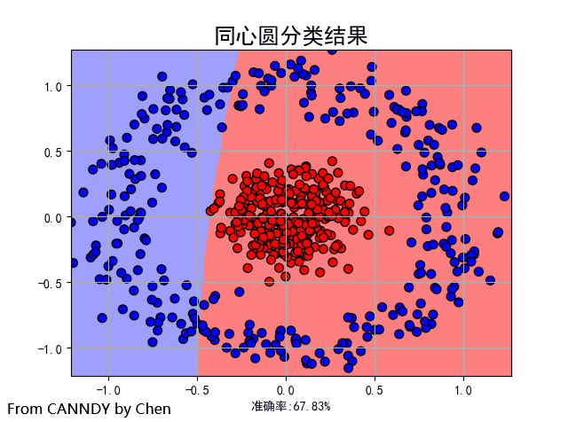
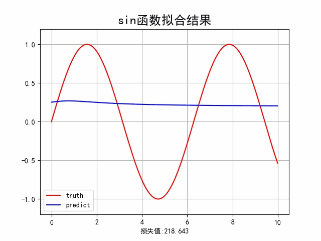

# CANNDY

## 介绍
纯Numpy实现的人工神经网络框架 
Chen's Artificial Neural Network builD by numpY

## 模型说明
### Core: 人工神经网络框架核心

- Activation: 实现的各种激活函数，包括`ReLU`、`Sigmoid`、`Softmax`
- Layer: 实现的各种基础的神经网络层，暂时只有`Linear`线性层
- Loss: 实现的各种损失函数，包括`均方差损失`，`交叉熵损失`
- Optimizer：实现的各种优化器，包括普通梯度下降`GradientDescent`、`Momentum`、`AdaGrad`、`RMSProp`、`Adam`

### Dataset: 数据集

- Iris: 鸢尾花数据集
- titantic: 泰坦尼克幸存者数据集
- mnist: 手写数字识别数据集
- 
### MLP: 使用该框架实现的多层感知机模型以及实例

- MLP: 多层感知机模型
- MLP_Batch: 测试batch的回归训练
- MLP_Classifier: 使用同心圆数据集做分类训练
- MLP_Iris: 使用鸢尾花数据集做分类训练
- MLP_Mnist: 使用手写识别数据集做分类训练
- MLP_Regress: 使用sin函数作为数据集做回归训练

### Examples: 使用该框架实现的各种模型实例

- AutoEncoder: 使用该框架实现的自编码器模型
- PolicyGradient: 使用该框架实现的策略梯度下降，待更新

## 安装教程

1.  Anaconda `python>=3.7`
2.  其他相关的包，可自行调试判断  

## 使用说明

- `本代码仅供参学习和学术研究下载`
- `Copy核心代码时请注明出处`

## 效果展示
- MLP对同心圆数据集做分类训练
 
- MLP对sin函数回归拟合 
 
## 参与贡献

wang567

