# 🍬 CANNDY
💬 Language：[English](README_EN.md) | [中文](README.md)

基于NumPy构建的人工神经网络框架<br>
Chen's Artificial Neural Network constructeD with numpY<br>

## 🔖 项目简介
本项目致力于为对神经网络和人工智能感兴趣的伙伴们提供一个学习和实践的平台。
虽然本项目不旨在构建大规模模型或直接用于生产环境的模型，
但力求通过实现一系列经典的神经网络模型，深入探讨神经网络的底层原理。
本项目提供了详尽的实现步骤，以帮助学习者深入理解神经网络的构建过程与内部工作的机制。

为了降低使用门槛，本项目在设计上借鉴了 PyTorch 的模型构建与训练风格，但专注于核心功能的实现，因此功能相对精简。
与成熟的工业级框架不同，本项目更注重算法实现的透明性和可读性，通过手写底层代码来揭示神经网络和深度学习模型的工作原理。
需要说明的是，本项目更适合学习和实验用途，如果需要用于生产环境，建议使用功能更完善的 [PyTorch](https://github.com/pytorch/pytorch) 等专业框架。

此外，本项目采用的不是基于计算图的构建方式，而是通过公式推导构建的层级架构，以便更直观地剖析神经网络的工作机制。
希望本项目能够帮助感兴趣的伙伴们建立起对神经网络的深刻理解，从而在人工智能领域的进一步学习和研究打下坚实的基础。

**特别说明：`本代码仅供参考学习、竞赛和科学研究等非商业用途，在复制核心代码时请注明出处`**

## 📚 安装教程
**1. 建议使用 `Anaconda` 创建 `Python` 环境**

  使用 Anaconda 创建环境可以方便地管理依赖包，避免版本冲突。建议从 [Anaconda 官网](https://www.anaconda.com/download/success) 下载并安装 Anaconda。如果需要特定版本，可以访问 [Anaconda所有版本下载地址](https://repo.anaconda.com/archive/)。

  安装完成后，运行以下命令创建 Python 环境：
  ```bash
  conda create --name my_env python=3.9
  conda activate my_env
  ```
  **注意**：本项目支持 Python 3.7 及以上版本，建议使用 Python 3.9 以获得最佳兼容性。

**2. 安装必要包**

  本项目依赖以下包:`numpy`、`matplotlib`、`tqdm`。请确保已安装 Python 3.7 或更高版本，运行以下命令一键安装必要包：
  
  ```bash
  pip install numpy matplotlib tqdm
  ```

**3. 镜像源选择**

  如果在运行安装命令时发现下载速度较慢，可以尝试使用清华大学的镜像源进行安装。安装命令如下：
  ```bash
  pip install numpy matplotlib tqdm -i https://pypi.tuna.tsinghua.edu.cn/simple
  ```
  注意：如果无法访问上述镜像源，也可以选择其他可用的镜像源，例如中国科技大学、阿里云等。


## 🎯 核心实现

- **Activation: 激活函数**
  - ReLU/Sigmoid/Tanh/Softmax

- **Layers: 神经网络层**
  - Linear: 线性层(全连接单层)
  - Indentity: 恒等变换层
  - Dropout: 随机失活层
  - GCNConv: 图卷积层
  - RNNCell: 循环神经网络模块
  - RNN: 循环神经网络层
  - Flatten: 展平层
  - Conv1d: 一维卷积层
  - Conv2d: 二维卷积层
  - MaxPool1d: 一维最大池化层
  - MaxPool2d: 二维最大池化层
  - MeanPool1d: 一维平均池化层
  - MeanPool2d: 二维平均池化层
  - BatchNorm: 批归一化层
  - BatchNorm2d: 二维批归一化层
  - ReLULayer: ReLU激活层
  - SigmoidLayer: Sigmoid激活层
  - TanhLayer: Tanh激活层
  - SoftmaxLayer: Softmax激活层

- **Loss: 损失函数**
  - MSELoss: 均方误差损失
  - CrossEntropyWithSoftmax: 带Softmax的交叉熵损失
  - CrossEntropyWithSoftmaxMask: 带Softmax和Mask的交交叉熵损失

- **Module: 神经网络模型**
  - MLP: 全连接神经网络模型(多层感知机)
  - GCN: 图卷积神经网络模型
  - RNNModel: 循环神经网络模型
  - CNNTimeSeries: 一维卷积神经网络模型
  - LeNet5: LeNet-5卷积神经网络模型

- **Optimizer: 优化器(优化算法)**
  - GD/Momentum/AdaGrad/RMSProp/Adam

## 📦 框架结构
```
CANNDY/
├── Core/                               # 人工神经网络框架核心
│   ├── Activation.py                   # 实现各种激活函数
│   ├── Layers.py                       # 实现各种神经网络层
│   ├── Loss.py                         # 实现各种损失函数
│   ├── Module.py                       # 实现各种神经网络模型
│   └── Optimizer.py                    # 实现各种优化器
├── Datasets/                           # 数据集
│   ├── Mnist_Test/                     # 手写数字识别数据集(单独生成)
│   ├── cora.tar.gz                     # 图神经网络数据集Cora
│   ├── iris.csv                        # 鸢尾花数据集
│   ├── mnist.pkl.gz                    # 手写数字识别数据集
│   └── titanic.csv                     # 泰坦尼克幸存者数据集
├── Examples/                           # 使用该框架实现的各种具体实例模型
│   ├── AutoEncoder/                    # 自编码器模型
│   │   ├── AutoEncoder.py              # 自编码器模型
│   │   └── train_AutoEncoder.py        # 运行自编码器模型实例
│   ├── DQN/                            # 深度Q-学习网络模型
│   │   ├── agent.py                    # DQN智能体
│   │   ├── algorithm.py                # DQN算法
│   │   ├── DQNLoss.py                  # DQN损失函数
│   │   ├── replay_memory.py            # 经验回放池
│   │   ├── train_DQN_CartPole.py       # 训练DQN玩CartPole
│   │   └── train_DQN_Snake.py          # 训练DQN玩贪吃蛇
│   ├── PolicyGradient/                 # 策略梯度网络模型
│   │   ├── agent.py                    # PG智能体
│   │   ├── algorithm.py                # PG算法
│   │   ├── PGLoss.py                   # PG损失函数
│   │   ├── replay_memory.py            # 经验回放池
│   │   ├── train_PG_CartPole.py        # 训练PG玩CartPole
│   │   └── train_PG_Snake.py           # 训练PG玩贪吃蛇
│   └── RL_Envs/                        # 强化学习环境(单独实现)
│       ├── CartPole.py                 # CartPole环境
│       └── Snake.py                    # 贪吃蛇游戏环境
├── Models/                             # 使用该框架实现的几种经典的模型
│   ├── CNN/                            # 卷积神经网络
│   │   ├── CNN_Mnist.py                # 卷积神经网络学习手写数字识别分类
│   │   ├── CNN_Series.py               # 卷积神经网络学习周期数据回归
│   │   ├── CNN_Visualize.py            # 卷积神经网络学习手写数字识别结果可视化
│   │   ├── LeNet-5_Params.json         # 卷积神经网络学习手写数字识别所得参数
│   │   └── Plot_Contrast.py            # 卷积神经网络不同参数效果对比绘图
│   ├── GCN/                            # 图卷积神经网络
│   │   └── GCN_Cora.py                 # 图卷积神经网络学习Cora数据
│   ├── MLP/                            # 全连接神经网络(多层感知机)
│   │   ├── MLP_Batch.py                # 全连接神经网络学习批数据测试
│   │   ├── MLP_Classifier.py           # 全连接神经网络简单分类测试
│   │   ├── MLP_Iris.py                 # 全连接神经网络对鸢尾花数据集分类测试
│   │   ├── MLP_Mnist.py                # 全连接神经网络学习手写数字识别分类
│   │   ├── MLP_Regress.py              # 全连接神经网络学习简单数据回归
│   │   └── Plot_Classifier.py          # 对分类结果绘图函数
│   └── RNN/                            # 循环神经网络
│       └── RNN_Predict.py              # 循环神经网络学习周期数据回归
├── Notes/                              # 框架实现的细节笔记
├── Pics/                               # 框架实现的模型运行效果图
└── README.md                           # 项目文档
```

## 🚀 快速开始

### 实现笔记

在深入了解框架的使用之前，可以通过以下笔记链接深入了解框架的实现细节和设计思路：

- **基础知识与公式推导**：[基础知识](./Notes/Basic.md)  
  详细介绍了神经网络与反向传播的数学公式推导。

- **激活函数的实现**：[激活函数](./Notes/Activation.md)  
  详细介绍了框架支持的激活函数及其特性。

- **层级架构核心设计**：[层级架构](./Notes/Layer.md)  
  介绍了层级架构的设计以及如何实现的神经网络各层。

- **损失函数的实现**：[损失函数](./Notes/Loss.md)  
  介绍了框架中实现的常见损失函数及实现思路。

- **梯度优化器的实现**：[梯度优化器](./Notes/Optimizer.md)  
  详细介绍了框架支持的优化器及其参数设置。

- **神经网络模块与模型设计**：[模型与模块](./Notes/Module.md)  
  介绍了如何实现神经网络模块与常见的几种网络模型。

### 模型构建

以一个简单的二分类任务为例，假设我们需要构建一个模型用于对同心圆数据进行分类。我们可以使用全连接神经网络（多层感知机）来实现。以下是一个输入维度为2、输出维度为2、隐藏层维度为3的模型构建示例。

```python
from Core.Module import Module, Linear  # 导入Module和Linear类
from Core.Activation import Sigmoid, Softmax  # 导入激活函数

class MLPDemo(Module):
    def __init__(self):
        # 调用父类Module的构造方法来初始化父类的属性
        # 子类会继承父类的属性和方法
        super().__init__()
        # 构建一个简单的全连接神经网络
        self.Layers = [
            Linear(2, 3, Sigmoid),
            Linear(3, 2, Softmax)
        ]
    
    def forward(self, input_):
        # 覆写前向传播函数
        hidden = input_.copy()
        for layer in self.Layers:
            hidden = layer(hidden)
        output = hidden
        return output
```
**注意**：为了使模型能够进行反向传播训练，模型必须继承 [Core.Module](Core/Module.py) 下的 `Module` 父类，并且需要将需要训练的网络部分放到 `Layers` 中。`Module` 父类会通过 `backward` 函数按照 `Layers` 中的层级架构逐步反向传播梯度。此外，必须覆写 `forward` 函数。

可以看到，模型的构建方式与 PyTorch 类似，但本项目通过调用 [Core.Layer](Core/Layer.py) 下的 `Linear` 来实现线性层，并且额外支持为每个线性层指定激活函数。

如果想学习构建更通用的全连接神经网络模型，可以参考 [Core.Module](Core/Module.py) 下的 `MLP` 的实现。

### 模型训练

模型构建完成后，可以使用梯度优化器对模型进行反向传播和梯度下降训练。首先，需要实现一个训练一轮（epoch）的函数：

```python
import numpy as np
from Core.Loss import CrossEntropyWithSoftmax  # 导入损失函数

def train_epoch(model, optimizer, X, Y, batch_size):
    """训练一轮(训练一个epoch)"""
    train_loss = 0  # 训练损失初始化
    for i in np.arange(0, len(X), batch_size):
        # 提取一个batch的输入数据和真实数据
        input_ = X[i:i + batch_size, :]
        truth = Y[i:i + batch_size, :]
        # 得到模型的预测输出
        output = model.forward(input_)
        # 初始化模型的预测损失
        Loss = CrossEntropyWithSoftmax(model, truth, output)
        # 前向传播损失并计算模型的预测损失
        ces_loss = Loss.forward()
        # 记录训练损失
        train_loss += ces_loss
        # 优化器梯度置0
        optimizer.zero_grad()
        # 将损失进行反向传播
        Loss.backward()
        # 优化器优化一步
        optimizer.step()
        
    return model, optimizer, train_loss
```

为了评估模型的准确率，还需要额外定义一个评估函数：

```python
import numpy as np

def valid_model(model, input_, truth):
    """对模型准确率进行评估"""
    # 得到模型的预测输出
    output = model.forward(input_)
    predict = np.argmax(output, axis=1)
    # 计算模型的预测准确率
    accuracy = np.array(predict == truth.flatten(), dtype=int).sum() / len(truth)
    return accuracy
```

接下来，可以对模型进行训练。其中，`make_circles` 函数的实现可以参考 [MLP_Classifier](Models/MLP/MLP_Classifier.py)：

```python
from Core.Optimizer import Adam

# 获取同心圆状分布数据，X的每行包含两个特征，y是1/0类别标签
X, Y = make_circles(600, noise=0.12, factor=0.2)
Y = Y.reshape(-1, 1)  # 重整真实数据形状为(n, 1)
# 初始化之前定义的模型
model = MLPDemo()
num_epochs = 20  # 训练的总轮数
batch_size = 16  # 批处理的大小
# 初始化梯度优化器：使用Adam优化器，学习率设置为0.05
optimizer = Adam(model=model, learning_rate=0.05)
for epoch in range(num_epochs):
    # 训练模型，训练一轮（训练一个epoch）
    model, optimizer, train_loss = train_epoch(model, optimizer, X, Y, batch_size)
    # 对模型准确率进行一个评估
    accuracy = valid_model(model, X, Y)
    # 打印每轮训练的结果
    print("epoch: [{:d}/{:d}], loss: {:.3f}, accuracy: {:.3f}".format(epoch + 1, num_epochs, train_loss, accuracy))
```

通过以上步骤，即可以快速构建并训练一个简单的全连接神经网络模型。

## 📝 更新计划

- [x] 更新项目文档
- [ ] 更新算法笔记
- [ ] 尝试实现更复杂的模型

## 🌈 效果展示

- MLP模型对同心圆数据集分类效果/对sin函数回归拟合效果

    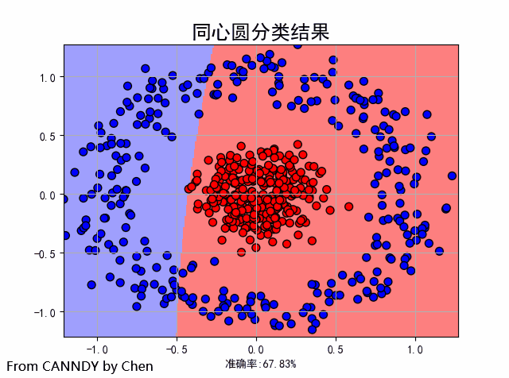
    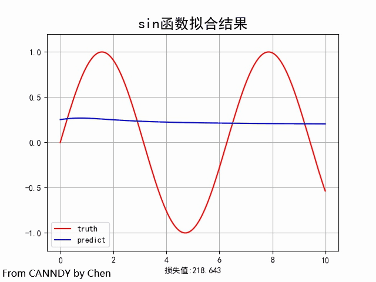
  
- 循环神经网络模型与一维卷积时间序列模型对sin函数未来趋势预测效果

    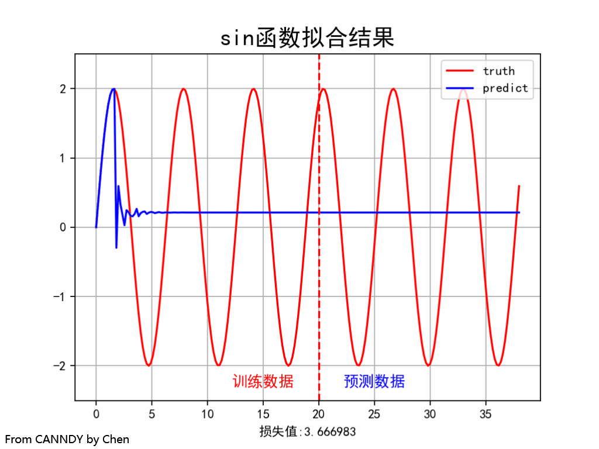
    
  
- 卷积神经网络LeNet-5模型手写数字的识别效果(测试集准确率超过99%)

1. 训练损失与测试准确率表现及不同trick下的模型表现

    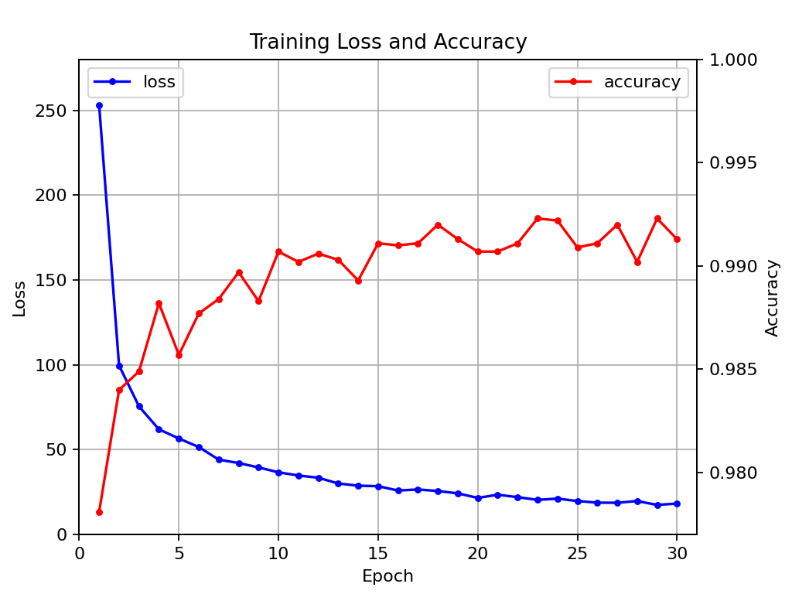
    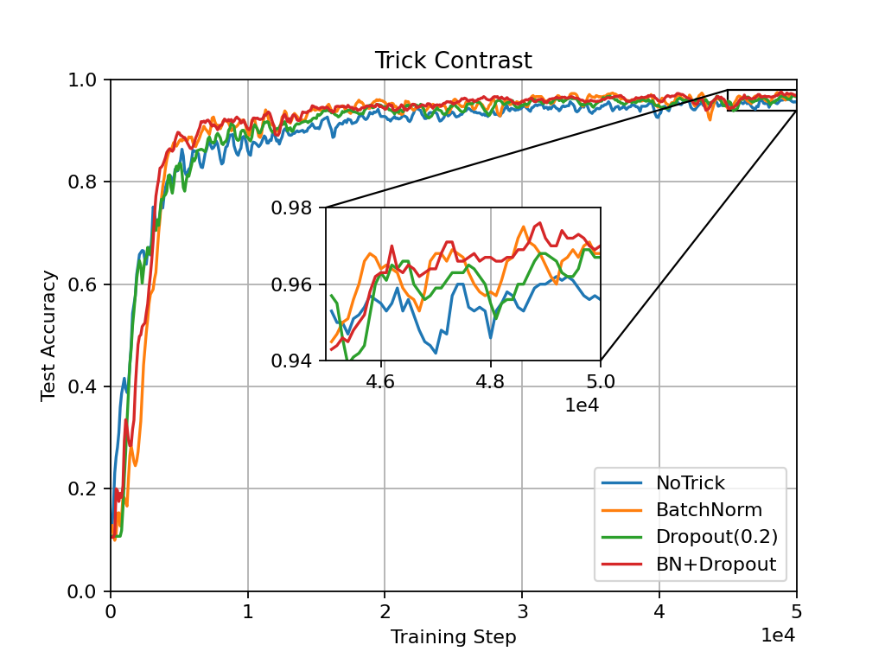
   
2. 输入图像与输出预测结果及概率

    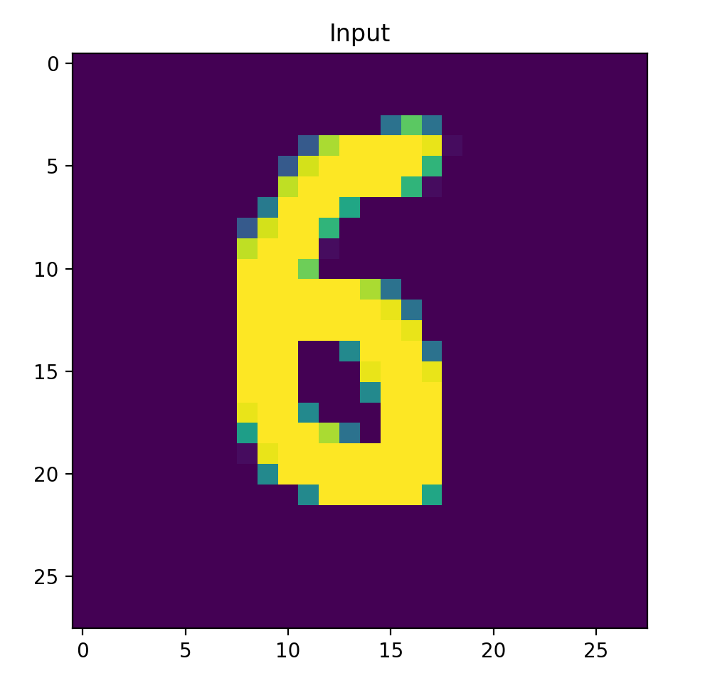
    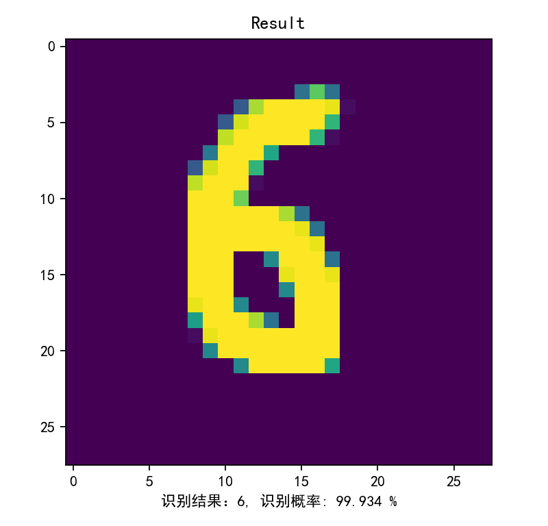
   
3. 第1层卷积层和第1层池化层得到的特征图

    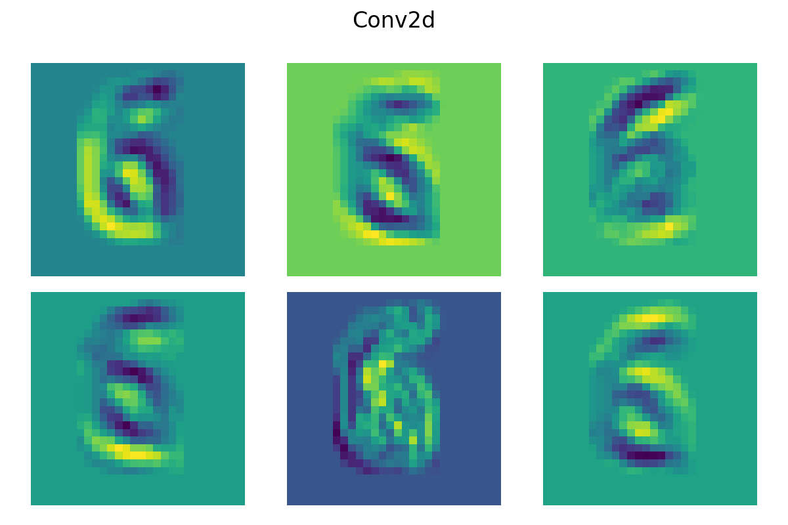
    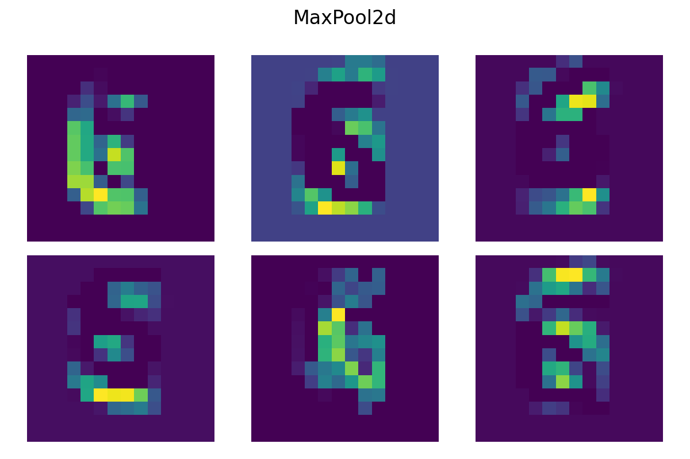
   
4. 第2层卷积层和第2层池化层得到的特征图

    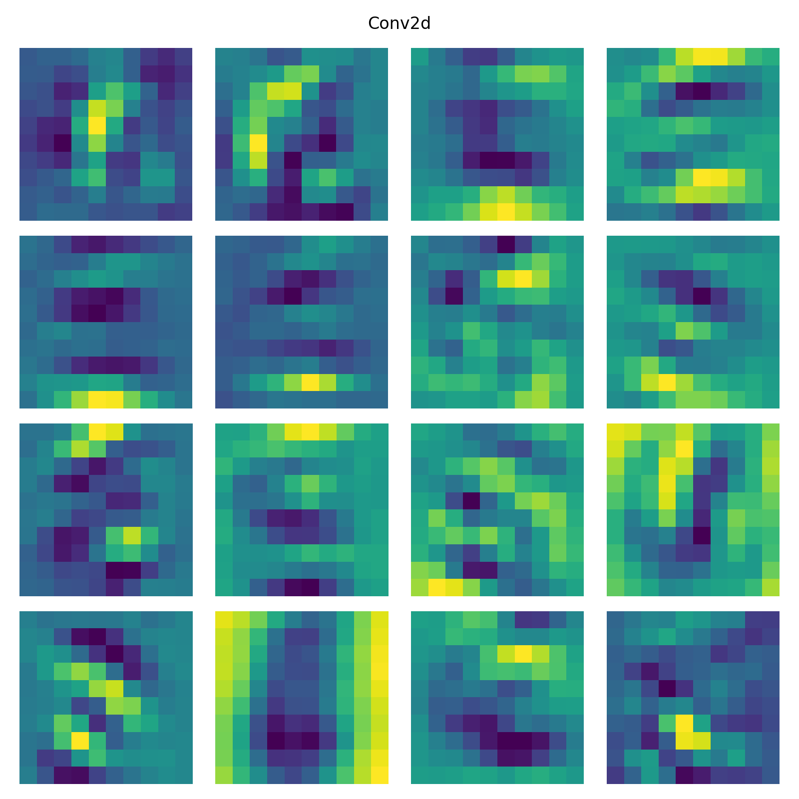
    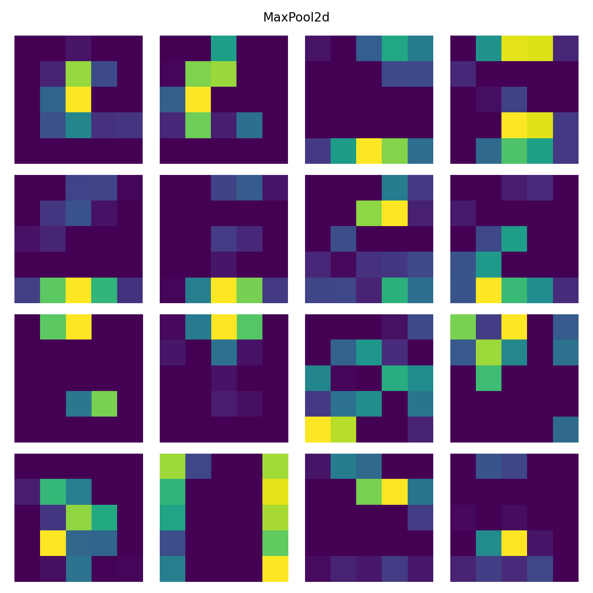
- 自编码器模型效果

    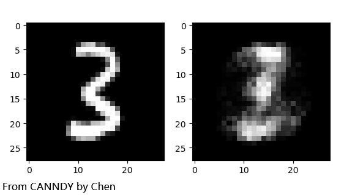

- DQN(深度Q学习网络)模型训练玩贪吃蛇最终效果

    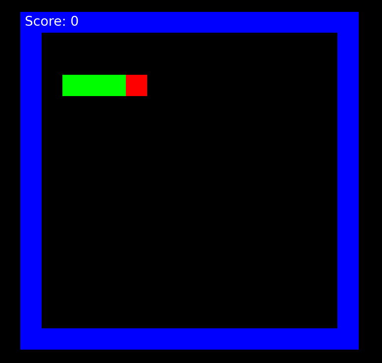

- PG(策略梯度网络)模型训练玩CartPole最终效果

    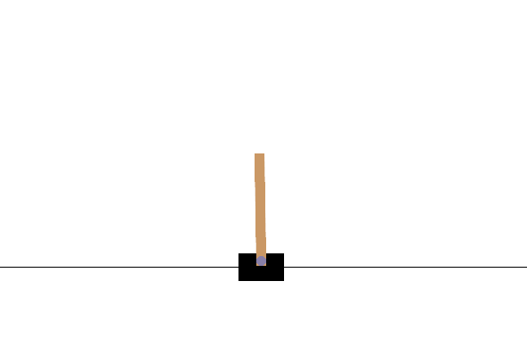

## 🤝 项目贡献

**Author: Luchen Wang**

## ✉️ 联系我们

**邮箱: wangluchen567@qq.com**


