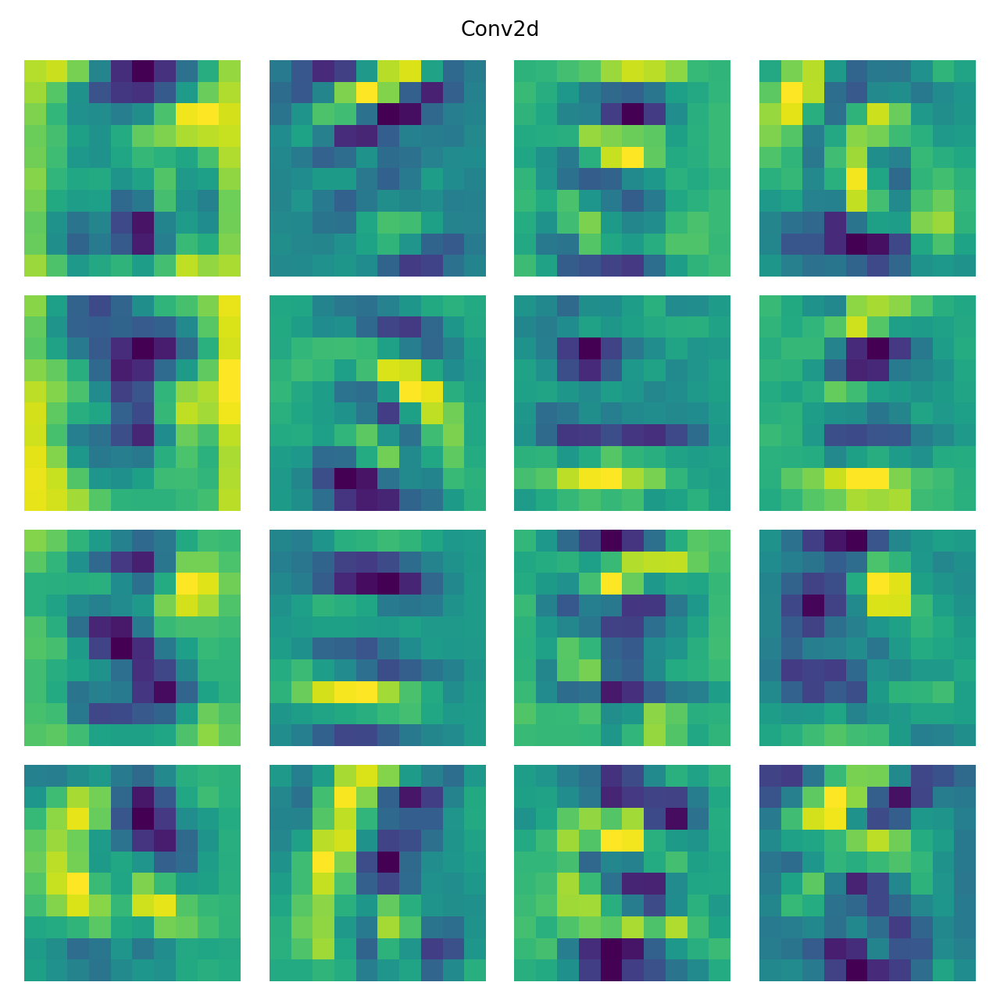

# CANNDY

## 项目名称
基于NumPy构建的人工神经网络框架 
Chen's Artificial Neural Network constructeD with numpY 

## 项目简介
本项目致力于为对神经网络和人工智能感兴趣的伙伴们提供一个学习和实践的平台。
本项目不旨在构建大规模模型或直接用于生产环境的模型，
但力求通过实现一系列经典的神经网络模型，深入探讨神经网络的底层原理。
本项目提供了详尽的实现步骤，以帮助学习者深入理解神经网络的构建过程与内部工作的机制。
希望本项目能够帮助感兴趣的伙伴们建立起对神经网络的深刻理解，从而在人工智能领域的进一步学习和研究打下坚实的基础。

## 模型说明
### Core: 人工神经网络框架核心

- Activation: 实现各种激活函数，包括`ReLU`、`Sigmoid`、`Tanh`、`Softmax`
- Layer: 实现各种神经网络层，包括`Linear`、`Dropout`、`GCNConv`、`RNN`、`Conv2d`、`MaxPool2d`、`BatchNorm`等
- Loss: 实现各种损失函数，包括`均方差损失`，`交叉熵损失`
- Module: 实现各种神经网络模型，包括`MLP`、`GCN`、`RNNModel`、`LeNet5`
- Optimizer：实现各种优化器，包括`GradientDescent`、`Momentum`、`AdaGrad`、`RMSProp`、`Adam`

### Dataset: 数据集

- Iris: 鸢尾花数据集
- cora: 文献引用网络数据集
- titantic: 泰坦尼克幸存者数据集
- mnist: 手写数字识别数据集

### Models: 使用该框架实现的几种经典的模型
#### MLP: 使用该框架实现的多层感知机模型实例

- MLP_Batch: 测试batch的回归训练
- MLP_Classifier: 使用同心圆数据集做分类训练
- MLP_Iris: 使用鸢尾花数据集做分类训练
- MLP_Mnist: 使用手写识别数据集做分类训练
- MLP_Regress: 使用sin函数作为数据集做回归训练

#### RNN: 使用该框架实现的循环神经网络模型实例

- RNN_Predict: 使用RNN进行预测未来步的训练

#### CNN: 使用该框架实现的卷积神经网络模型实例

- CNN_Mnist: 使用CNN对手写数字训练集的训练
- CNN_Visualize: 对CNN各层特征图的可视化

#### GCN: 使用该框架实现的图卷积模型实例
- GCN_Cora: 使用GCN对Cora图数据集的训练

### Examples: 使用该框架实现的各种具体实例

- AutoEncoder: 使用该框架实现的自编码器模型
- DQN: 使用该框架实现的强化学习中DQN(深度Q学习网络)模型
- PolicyGradient: 使用该框架实现的强化学习中的策略梯度模型
- GCN: 使用该框架实现的图卷积模型

## 安装教程

1.  建议使用Anaconda `python>=3.7`
2. 必要的库包：`python>=3.7`、`numpy`、`matplotlib`、`gzip`、`pickle`、`pillow`
3. 强化学习相关项目，gym 需要 gym==0.22.0; pygame==2.2.0
（贪吃蛇环境不需要，因为是单独实现的）
4. 其他相关的包，可自行调试判断

## 使用说明

- `本代码仅供参考学习和学术研究下载`
- `Copy核心代码时请注明出处`

## 效果展示
- MLP模型对同心圆数据集分类效果/对sin函数回归拟合效果 

 
- 循环神经网络模型对sin函数未来趋势预测效果 

- 卷积神经网络LeNet-5模型手写数字的识别效果(测试集准确率高达99%) 
0. 训练损失与测试准确率表现及不同trick下的模型表现 

1. 输入图像与输出预测结果及概率 

2. 第1层卷积层和第1层池化层得到的特征图 

3. 第2层卷积层和第2层池化层得到的特征图 

- 自编码器模型效果 
 
- DQN(深度Q学习网络)模型训练玩贪吃蛇最终效果 
 
- PG(策略梯度网络)模型训练玩CartPole最终效果 
 

## 参与贡献

Luchen Wang

