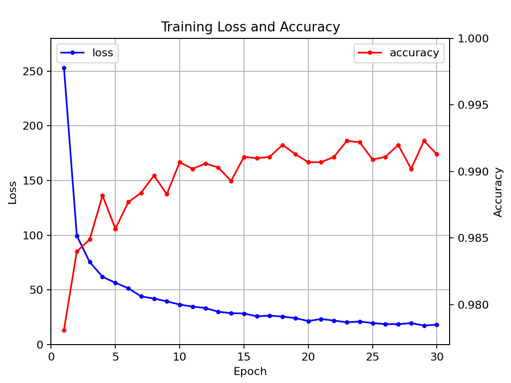
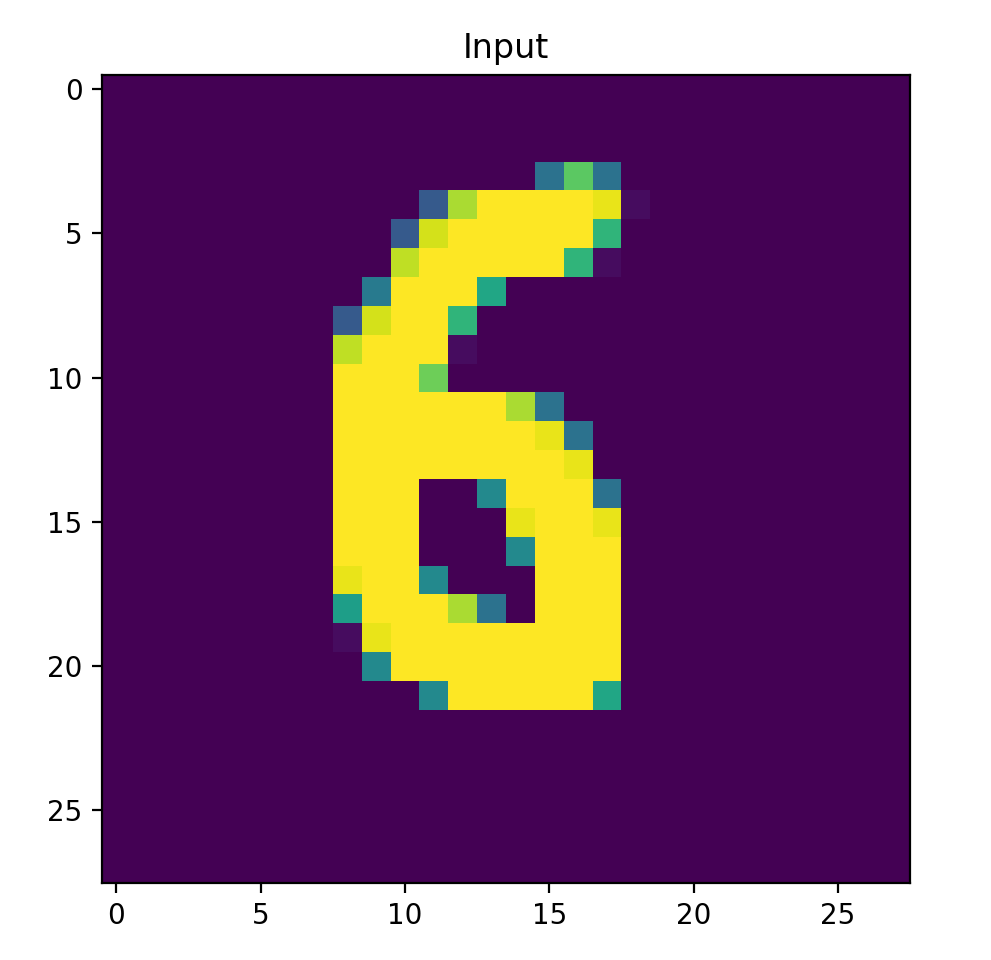
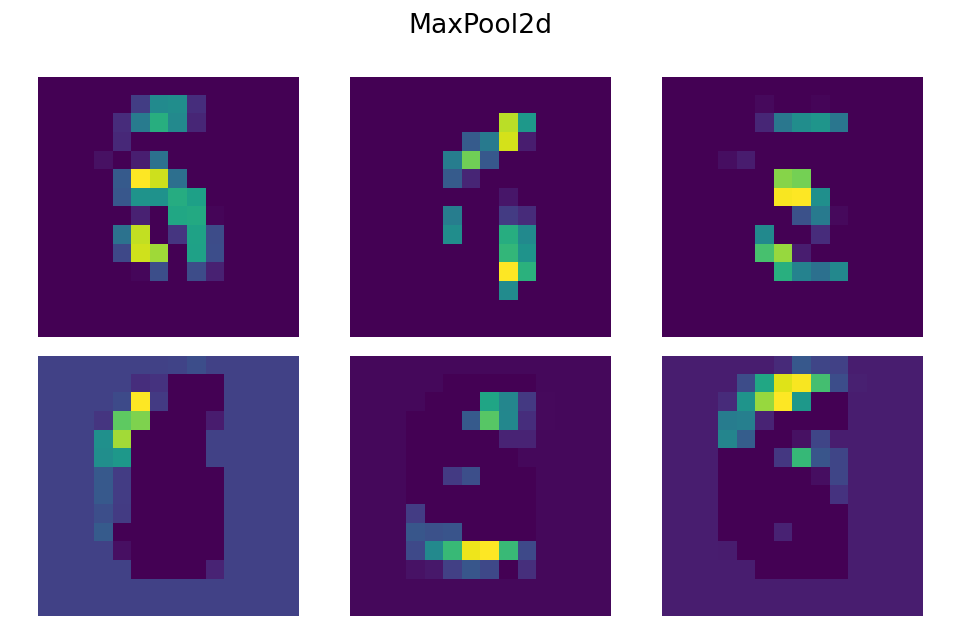
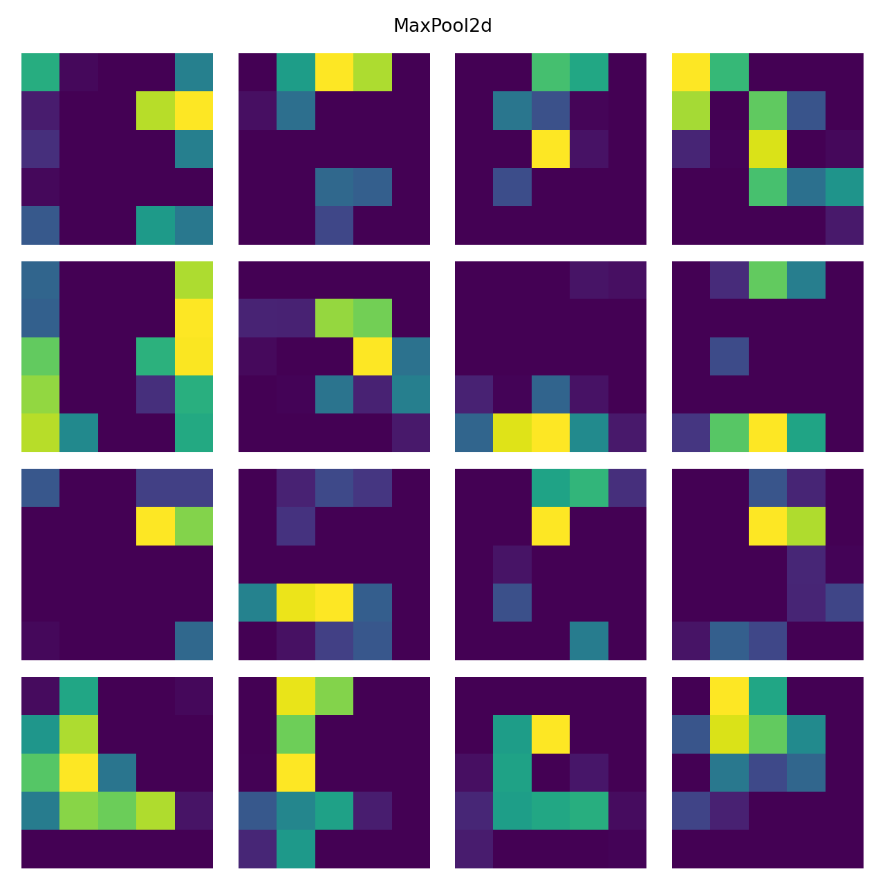
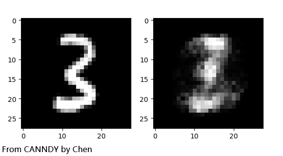
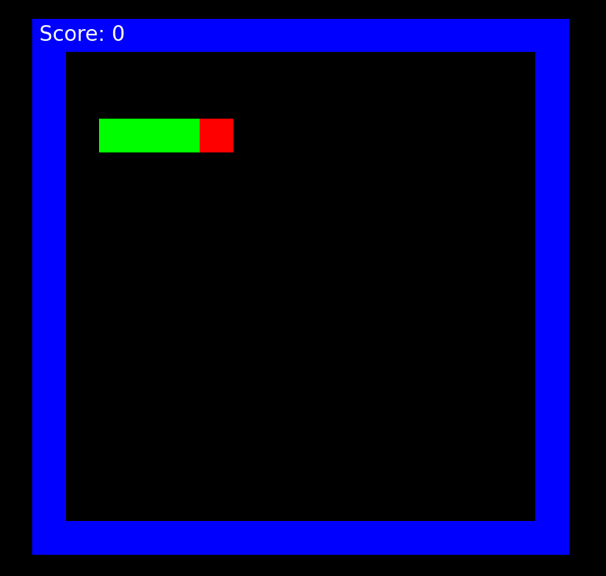

# CANNDY
Language：[English](README_EN.md) | [中文](README.md)

## Project Name
Chen's Artificial Neural Network constructeD with numpY

## Project Introduction
This project is dedicated to providing a learning and practice platform for those interested in neural networks and artificial intelligence.
It is not intended to build large-scale models or models directly used in production environments.
Instead, it aims to delve into the underlying principles of neural networks by implementing a series of classic neural network models.
The project offers detailed implementation steps to help learners gain a deep understanding of the construction process and internal workings of neural networks.
Moreover, it does not adopt the construction method based on computational graphs, but rather builds a hierarchical architecture through formula derivation, so as to more intuitively analyze the working mechanism of neural networks.
It is hoped that this project can help interested individuals build a profound understanding of neural networks, thereby laying a solid foundation for further learning and research in the field of artificial intelligence.

**Special Note: This code is for reference only in non-commercial purposes such as learning, competition, and scientific research. Please indicate the source when copying the core code.**

## Installation Guide

**1. It is recommended to use `Anaconda` to create a `Python` environment**

  Creating an environment with Anaconda allows for convenient management of dependencies and avoids version conflicts. It is recommended to download and install Anaconda from the [Anaconda official website](https://www.anaconda.com/download/success). If a specific version is needed, you can visit the [Anaconda archive download page](https://repo.anaconda.com/archive/).

  After installation, run the following commands to create a Python environment:

  ```bash
  conda create --name my_env python=3.9
  conda activate my_env
  ```

  **Note**: This project supports Python 3.7 and above. It is recommended to use Python 3.9 for the best compatibility. Please ensure that Python 3.7 or a higher version is installed.<br>

**2. Install necessary packages**

  This project depends on the following packages: `numpy`, `matplotlib`, `tqdm`. Ensure that you have Python 3.7 or a higher version installed, and then run the following command to install the necessary packages:

  ```bash
  pip install numpy matplotlib tqdm
  ```

**3. Install optional packages**

  When training the reinforcement learning model on the CartPole environment in this project, you need to install game environment-related packages. Run the following command to install them:

  ```bash
  pip install gym==0.22.0 pygame==2.2.0 pyglet==1.5.27
  ```
  You may encounter the following error when using gym:
  ```
  ImportError: cannot import name 'rendering' from 'gym.envs.classic_control'
  ```
  If you encounter this issue, please place the rendering.py file in the ..\Anaconda\Lib\site-packages\gym\envs\classic_control\ directory.

  Reference URL: https://blog.csdn.net/qq_34666857/article/details/123551558

## Core Implementation

- **Activation: Activation Functions**
  - ReLU/Sigmoid/Tanh/Softmax

- **Layers: Neural Network Layers**
  - Linear: Linear layer (fully connected single layer)
  - Identity: Identity transformation layer
  - Dropout: Dropout layer (random deactivation)
  - GCNConv: Graph convolutional layer
  - RNNCell: Recurrent neural network cell
  - RNN: Recurrent neural network layer
  - Flatten: Flattening layer
  - Conv1d: 1D convolutional layer
  - Conv2d: 2D convolutional layer
  - MaxPool1d: 1D max pooling layer
  - MaxPool2d: 2D max pooling layer
  - MeanPool1d: 1D average pooling layer
  - MeanPool2d: 2D average pooling layer
  - BatchNorm: Batch normalization layer
  - BatchNorm2d: 2D batch normalization layer
  - ReLULayer: ReLU activation layer
  - SigmoidLayer: Sigmoid activation layer
  - TanhLayer: Tanh activation layer
  - SoftmaxLayer: Softmax activation layer

- **Loss: Loss Functions**
  - MSELoss: Mean squared error loss
  - CrossEntropyWithSoftmax: Cross-entropy loss with Softmax
  - CrossEntropyWithSoftmaxMask: Cross-entropy loss with Softmax and Mask

- **Module: Neural Network Models**
  - MLP: Multilayer perceptron (fully connected neural network model)
  - GCN: Graph convolutional neural network model
  - RNNModel: Recurrent neural network model
  - CNNTimeSeries: 1D convolutional neural network model
  - LeNet5: LeNet-5 convolutional neural network model

- **Optimizer: Optimizers (Optimization Algorithms)**
  - GD/Momentum/AdaGrad/RMSProp/Adam

## Update Plan

- [x] Update project documentation
- [ ] Update algorithm notes
- [ ] Attempt to implement more complex models

## Effect Demonstration

- Classification effect of the MLP model on concentric circle dataset / Regression fitting effect on the sin function

    
    
  
- Prediction effect of the RNN model and the 1D convolutional time series model on the future trend of the sin function

    
    
  
- Recognition effect of the Convolutional Neural Network LeNet-5 model on handwritten digits (Test set accuracy exceeds 99%)

1. Training loss and test accuracy performance, as well as model performance under different tricks

    
    
   
2. Input images and output prediction results with probabilities

    
    
   
3. Feature maps obtained from the first convolutional layer and the first pooling layer

    
    
   
4. Feature maps obtained from the second convolutional layer and the second pooling layer

    
    
- Effect of the Autoencoder model

    

- Final effect of the DQN (Deep Q-Learning Network) model trained to play Snake

    

- Final effect of the PG (Policy Gradient Network) model trained to play CartPole

    

## Contributions & Support

**Author: Luchen Wang**<br>
<small>(If you encounter any issues during use, feel free to contact via email: wangluchen567@qq.com)</small>